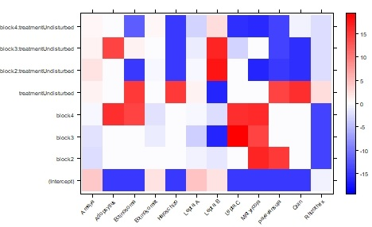

class: inverse, center, middle 

# mvabund

---

# mvabund 
.footnote[Wang *et al.* (2012)]

R package published in 2012  

**M**ulti**v**ariate **Abund**ance data  

--
        
.content-box-blue[Multivariate]  
`r fa("list-ol")` `r fa("list-ol", color = "white")` many, possibly correlated responses 

--
        
.content-box-blue[Abundance]  
`r fa("chart-line")` `r fa("list-ol", color = "white")` strong mean-variance relationship 

---
        
# Notation 


|  matrix            |  dimensions  |  content                              |  elements      |
| :----------------- |:------------ |:------------------------------------- |:------------   |
| **Y**              | N $\times$ S | occurrences \ abundances | $y_{is}$       |
| **X**              | N $\times$ P | environmental variables               | $x_{ip}$       |
| $\mathbf{\Lambda}$ | R $\times$ S | species loadings                      | $\lambda_{rs}$ |  
| **H**              | N $\times$ R | site loadings                         | $\eta_{ir}$    |
| **T**              | S $\times$ J | species traits                        | $t_{sj}$       |


---

# Multivariate GLMM

We could use mixed models and model the taxon as a random effect.

--
        
$$y_{is} \sim species\ + variable1\ + variable2\ + (0 + species|sample)$$

---

count:false

# Multivariate GLMM

We could use mixed models and model the taxon as a random effect.

$$\color {orange} {y_{is} \sim species\ + variable1\ + variable2} + (0 + species|sample)$$
--

```{r glmm-example-data, echo=F}
data = data.frame(abundance = round(runif(4, 10,70),0) ,
                  species = rep(c("Daphnia magna", "Gammarus pullex"), each = 2),
                  treatment = c(0,1,0,1),
                  temperature = rnorm(4, 20,1)
                  )
data %>% 
  kable(format = "html") %>% 
  kable_minimal()
```


---

count:false

# Multivariate GLMM

We could use mixed models and model the taxon as a random effect.

$$y_{is} \sim species\ + variable1\ + variable2\ + \color {orange} {(0 + species|sample)}$$
--
.center[0 - no intercept]
  
$$species|sample \rightarrow z_{is} \sim N(0, \Sigma)$$

--

The variance-covariance matrix $\Sigma$ shows correlations between species after accounting for the variables


---

# GLMM assumptions 

`r fa("dice-one")` `r fa("list-ol", color = "white")` $y_{is}$ are .blue[independent], conditional on mean  $\mu_{is}$  

--

`r fa("dice-two")` `r fa("list-ol", color = "white")` Conditional on $\mu_{is}$, data come from a .blue[known distribution]    

--
        
`r fa("dice-three")` `r fa("list-ol", color = "white")` .blue[straight line relationship] between some function of $\mu_{is}$ and $x$  

$$g(\mu_{is}) = \alpha_{s} + \beta_sx_{i} + \epsilon_{is}$$
--

`r fa("dice-four")` `r fa("list-ol", color = "white")` $\epsilon$ are normally distributed.   
$$\epsilon_{is} \sim MVN(0, \Sigma)$$

--
        
They represent correlation between responses $s$ within samples $i$. 

---
# Implementations in R
        
- lme4 (Bates *et al*., 2015)
- MCMCglmm (Hadfield, 2010)
- purpose written code (e.g. Pollock *et al*. 2014)

--
        
.blockquote[
### `r fa("comment-dots")` Question
What is problematic with this approach?
]

---

# Problem? Parameters! 
        
|  # responses | # parameters in $\Sigma$ |
| :---- |:--- |
| 5     | 15 |
| 10    | 55 |
| 20    | 210 |
| 40    |  820 |

--
.pull-left[
.content-box-blue[maximum likelihood]  
- No convergence
]

--
        
.pull-right[
.content-box-blue[bayesian]  
- long run time  
- not all parameters converge  
- big influence of prior
]

---
        
# Simplify
    
`r fa("long-arrow-alt-right")``r fa("long-arrow-alt-right", color = "white")` Instead of estimating $\boldsymbol{\Sigma}$ we can .blue[assume] it.

--

`r fa("cog")``r fa("long-arrow-alt-right", color = "white")` That's how .blue[mvabund] works 

--

`r fa("thumbs-up")``r fa("long-arrow-alt-right", color = "white")` Ok, if primary interest is species-environment relationships  

--

`r fa("cog")``r fa("long-arrow-alt-right", color = "white")` Fit a separate GLM to each species

--

`r fa("question")``r fa("long-arrow-alt-right", color = "white")`
How is that multivarite 


--

`r fa("exclamation")``r fa("long-arrow-alt-right", color = "white")`
... only at the infernce stage


---

# Test statistics  

--

.content-box-blue[Likelihood Ratio] 

\begin{align}
LR &= 2 log \frac{L_{at\ MLE}}{L_{at\ H_0}} \\
LR &= 2 [log (L_{at\ MLE}) - log(L_{at\ H_0})]\\
LR &\sim \chi^2_{p_MLE - p_{H_0}}
\end{align}

--

.content-box-blue[Sum of Likelihood Ratios]  

$$\Sigma LR = \Sigma_s^SLR_s$$

--

- the test statistic does not account for inter-species correlations    
- but the permutation-based *p* -value does  

---

# Test statistics 
   
.content-box-blue[Wald statistic]  
\begin{align}
W &= \frac{(\beta_m - \beta_0)^2}{var(\beta_m)} \\
z &= \sqrt(W)
\end{align}

--

.content-box-blue[Score statistic]   
.center[ see e.g. Dunn & Smyth (2018)]

---

# Permutational *p* - values

1. data + statistical test `r fa("long-arrow-alt-right")` *true* test statistic  

--

2. shuffle data + statistical test `r fa("long-arrow-alt-right")` permutation test statistic

--

3. repeat step two often (1000 times at least)

--

4. What percentage of permutation test statistics is more extreme than the *true* test statistic?

---

# Permutational *p* - values: Example 

.scroll-output[
```{r permutation-example-data}
data = data.frame(sample = 1:10,
                  Daphnia_magna  = rpois(n = 10, lambda = 1:10),
                  Gammarus_pulex = rpois(n = 10, lambda = 10:1),
                  Daphnia_pulex  = rpois(n = 10, lambda = 5),
                  temperature    = round(rnorm(n = 10, mean = seq(from = 20, to = 25, length.out = 10),sd = .5),1)
                  )
data %>% 
  kable(format = "html") %>% 
  kable_minimal()
```
```{r permutation-fit-glm, echo=T}
m_true = glm(Daphnia_magna ~ temperature, data = data)
for (i in 1:999){
        if(i == 1) m_perm = list()
        data_loop = data
        data_loop$temperature = data_loop$temperature[sample(1:10,10, replace =F)]
        m_perm[[i]] = glm(Daphnia_magna ~ temperature, data = data_loop)
}
stat_true = lmtest::lrtest(m_true)$Chisq[2]
stat_perm = lapply(X = m_perm, FUN = lmtest::lrtest) %>% 
        lapply(FUN = function(x)x$Chisq[2]) %>% 
        unlist()
sum(stat_true<stat_perm)/1000  
```
]

---

# Correlation options
  
.footnote[Warton (2008a, 2011)]
  
.content-box-blue["I"]  
No correlation, default setting $\color{white}{\boldsymbol{I} = \begin{bmatrix}1&0&0\\0&1&0\\0&0&1\end{bmatrix}}$
--
$\boldsymbol{I} = \begin{bmatrix}1&0&0\\0&1&0\\0&0&1\end{bmatrix}$

--

.content-box-blue["R"]   
estimates $\boldsymbol{\Sigma}$, like the GLMM

--

.content-box-blue["shrink"]  
middle option, shrinks $\boldsymbol{\Sigma}$ to $\boldsymbol{I}$ with ridge regularization 
  
--
  
- For .blue[R] and .blue[shrink] $\Sigma LR$ is not available. 
- They are estimated with .blue[generalized estimation equations] which do not produce likelihoods. 

---

#MvAbund Example 

```{r mvabund-setup-see, echo=T, eval =F}
library(mvabund)
data("Tasmania")
attach(Tasmania)
head(copepods[,1:3])
```

--

```{r mvabund-setup-do}
library(mvabund)
data("Tasmania")
attach(Tasmania)
head(copepods[,1:3])
```

--

```{r mvabund-data-show, echo = T, eval = F}
tasmvabund <- mvabund(copepods)
class(tasmvabund)
```

--

```{r mvabund-data-do, eval = T}
tasmvabund <- mvabund(copepods)
class(tasmvabund)
```
---

# Raw data graph 
.footnote[Warton (2008b)]
```{r mvabund-raw-abundance-plot, fig.height=6}
plot(tasmvabund~treatment, col = as.numeric(block))
```

---
# mean-variance plot

```{r mvabund-mean-var-plot-do, fig.height=7}
# png(filename = "../004_plots/R_mvabund_mean-var_plot.png")
# meanvar.plot(copepods~tr.block, col = as.numeric (treatment))
# dev.off()
knitr::include_graphics("figures/R_mvabund_mean-var_plot.png", dpi = 90)
```

---

# Fitting a model 
```{r mvabund-fit-model, echo = T}
tas.nb <- manyglm(copepods ~ block*treatment,
                  family = "negative.binomial")
```

\begin{align}
y_{is} &\sim NB(\mu_{skl}, \phi_s)\\
log(\mu_{s}) &= alpha_s + \beta_{block,s} block + \beta_{treamtent,s} treatment\\
&+ \beta_{interaction,s} block \times treatment
\end{align}

--

```{r fit-add-glms, eval = F, echo = T}
tas.nb.R <- manyglm(copepods ~ block*treatment,
                  family = "negative.binomial",
                  cor.type = "R")
tas.nb.s <- manyglm(copepods ~ block*treatment,
                    family = "negative.binomial",
                  cor.type = "shrink")
```

---

# Checking model assumptions 

```{r mvabund Checking model assumptions 1, fig.height=7, fig.width=7}
plot.manyglm(tas.nb, which = 1)
```

.footnote[Dunn & Smyth (1996)]

---

# Checking model assumptions
```{r mvabund Checking model assumptions 2, fig.height=7, fig.width=7}
plot.manyglm(tas.nb, which = 2)
```

.footnote[Dunn & Smyth (1996)]

---

# Checking model assumptions
```{r mvabund Checking model assumptions 3,  fig.height=7, fig.width=7}
plot.manyglm(tas.nb, which = 3)
```

.footnote[Dunn & Smyth (1996)]

---

# Testing Hypotheses

```{r mvabund-load-anova}
anova_out = readRDS("../003_processed_data/mvabund/anova/tasmania/anova_list.RDS")
anova_out = anova_out$cop_I_LR_pit.trap
```

```{r mvabund Testing Hypotheses, eval = FALSE, echo = T}
anova_out <- anova(tas.nb, p.uni = "adjusted")
```

.scroll-output[

```{r mvabund show anova, echo = F}
anova_out
```

]

---

# Beta plot 

```{r mvabund-make-beta-plot, eval = F}
library(lattice)
a <- max(abs(coef(tas.nb)))
colort <- colorRampPalette(c("blue", "white", "red"))
plot.tas <-
  levelplot(
    t(as.matrix(coef(tas.nb))),
    ylab = "",
    xlab  = "",
    col.regions = colort(100),
    at = seq(-a, a, length = 100),
    scales = list(x = list(rot = 45))
  )
jpeg("figures/mvabund_beta_plot.jpeg",  quality = 100, res = 50)
levelplot(
  t(as.matrix(coef(tas.nb))),
  ylab = "",
  xlab  = "",
  col.regions = colort(100),
  at = seq(-a, a, length = 100),
  scales = list(x = list(rot = 45))
)
dev.off()
```

.middle[
```{r mvabund-beta-plot, fig.height=9, fig.width=9}

```
]
---
# Prediction 
```{r mvabund-predictions, fig.height=7, fig.width=7}
tas_pred = predict(tas.nb, type = "response")
matplot(t(tas_pred[c(1,3),]), type = "l", xaxt = "n", log = "y", ylab = "Mean abundance [log]")
axis(1, at =1:12, labels = colnames(copepods), las = 3)
legend("topright", legend = levels(treatment), col = 1:2, lty = 1:2)
```

---

# Traits 
Not discussed in today.   
See here for introduction:
https://rpubs.com/dwarton/68823

---

# Conclusion: mvabund

- Recurring problem is estimating $\boldsymbol{\Sigma}$ - too many parameters 

--

- in mvabund only the inference is multivariate, models are fit separatly

--

- inference thorough row-permutation and aggregated test statistics. 