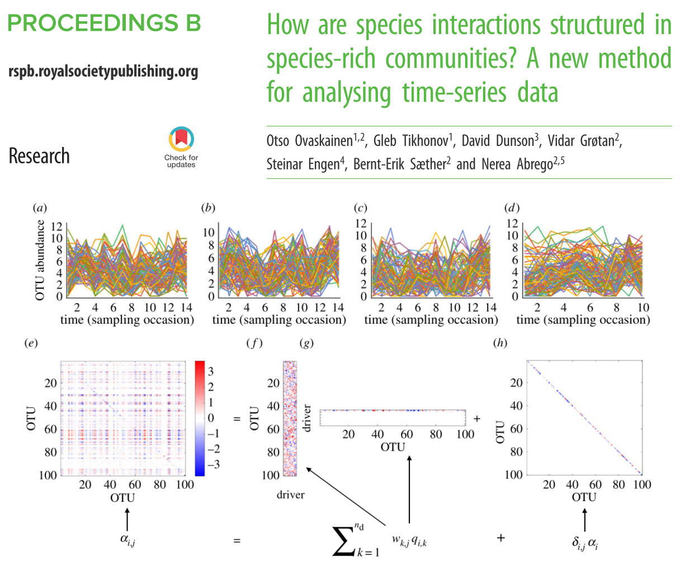

class: inverse, center, middle 

# Constrained Quadratic Ordination  
---

# Constrained Quadratic Ordination 

- model-based constrained .blue[ordination]

--

- something is .blue[quadratic]

--

- we fit models, but with .blue[latent variables] 

--

.blockquote[
### `r fa("comment-dots")` Question
What are latent variables? 
]

--

<blockquote>
A variable that cannot be measured directly, but is assumed to be related to a number of observable or manifest variables.
.right[-- <cite>Everitt & Skrondal (2010) </cite>]
</blockquote>

--

- like axes in a PCA

---

# Vector Generalized linear models 

.footnote[see Dobson & Barnett (2018) for more on the exponential family]

`r fa("comment")``r fa("box", color = "white")` proposed by Yee & Wild (1996)

--

`r fa("plus")``r fa("box", color = "white")` extend of GLM 

--

`r fa("box")``r fa("box", color = "white")` GLMs are restricted to distributions from the .blue[exponential family].    

--

`r fa("box-open")``r fa("box", color = "white")`VGLMs are not.  

--

`r fa("boxes")``r fa("box", color = "white")` VGLMs can have .blue[multiple linear predictors], for different parameters.

--

`r fa("clone")``r fa("box", color = "white")` Explanatory variables can differ between predictors.

---
# Distributional Models 
.footnote[see [here](https://paul-buerkner.github.io/brms/articles/brms_distreg.html) for more on distributional models in R]

--

.content-box-blue[OLS] 
$$y_i \sim N(\mu = \alpha + \beta_1 x_1, \sigma^2)$$
--

.content-box-blue[distributional model] 
$$y_i \sim N(\mu = \alpha_\mu + \beta_{\mu_1}x_1, \sigma^2 = \alpha_\sigma + \beta_{\sigma}x_1)$$
--

$$y_i \sim N(\mu = \alpha_\mu + \beta_{\mu}x_1, \sigma^2 = \alpha_\sigma + \beta_{\sigma}x_2)$$
--

.blockquote[
  ### `r fa("spinner", size = 2, animate = "spin")` Variation-explicit ecology 
  Modeling and thinking about variances instead of means.  
  See Holyoak & Wetzel (2020)
]

---

# Reduced Rank VGLM  

`r fa("arrow-down")` Reduce the dimensions of **X** with Reduced Rank Regression   

--

$$x^\prime_{ir} = \Sigma_{p=1}^P w_{rp}x_{ip}$$ 
w - .blue[constrained coefficients]


--

$$L = \beta x_1 + \beta^\prime x^\prime $$
$x_1$ contains variables not considered in the RRR (e.g. intercept)

--

.blockquote[
  ### `r fa("spinner", size = 2, animate = "spin")` still processing 
  Preselecting variables for latent variables based on theory
]

---

.footnote[Yee (2015)]

# Quadratic RR-VGLM

In ecology, unimodal responses are the norm (Oksanen & Minchin, 2002)  

```{r figure-unimodal-responses}
include_graphics("figures/yee15_1.png", dpi = 200)
```


--

\begin{align}
L    &= \beta x_1 + \beta^\prime x^\prime  & ordinary\ RR-VGLM \\
L    &= \beta x_1 + \beta^\prime x^\prime + \beta^{\prime\prime} \ x^{\prime 2} & quadratic\ RR-VGLM\ (CQO)
\end{align}

---
.footnote[Gauch & Whittaker (1972), ter Braak (1986), Yee (2004), Zuur et al. (2007)]

# Gaussian Regression 

$$Y_{is} = c_s\ exp\bigg(- \frac{(x_{ip} - u_{sp})^2}{2t_{sp}^2}\bigg) \text{  Gaussian Response Model}$$

--

$$P(x|\mu,\sigma) = \frac{1}{\sigma\sqrt{2\pi}} exp\bigg( -\frac{(x-\mu)^2}{2\sigma^2} \bigg) \text{  Normal Distribution}$$

--

As GLM:
\begin{align}
y_{is} &= exp \bigg(ln(c_s) - \frac{u_{sp}^2}{2t_{sp}^2} &+ \frac{u_{sp}}{t_{sp}^2}x_{ip} &- \frac{1}{2t_{sp}^2}x^2_{ip}\bigg)\\
       &= exp(b_{1s} &+ b_{sp}\ x_{ip} &+ b_{2sp}\ x_{ip}^2)
\end{align}

--

- CCA aproximates this, given a set of restrictive assumptions 
- CQO estimates parameters with MLE (IRLS)


---
# Hunting Spider Data

from ter Braak (1986)  

```{r load VGAM}
library(VGAM)
data(hspider)
```

```{r}
hspider %>%
  kbl(format = "html") %>%
  scroll_box(height = "400px", width = "700px")
```

---

# Rank-1 Poisson CQO

```{r cqo-run-dont-show, results='hide', echo=T}
set.seed(1234)
hspider[, 1:6] <- scale(hspider[, 1:6]) # Standardized environmental variables
r1_p_it <- cqo(cbind(Alopacce, Alopcune, Alopfabr, Arctlute, 
                     Arctperi, Auloalbi, Pardlugu, Pardmont, 
                     Pardnigr, Pardpull, Trocterr, Zoraspin) ~
                 WaterCon + BareSand + FallTwig + 
                 CoveMoss + CoveHerb + ReflLux,
               family = "poissonff",
               data = hspider,
               eq.toler = TRUE,
               I.tolerances = TRUE,
               trace = FALSE,
               Rank = 1)
```

```{r load other cqos, results='hide'}
cqo_list = readRDS("../003_processed_data/cqo/hspider/all_models.RDS")
## some additional options for plots 
S   = ncol(depvar(cqo_list$r1_p_i)) # Number of species
clr = (1:(S+1))[-7] # Omits yellow
```

---

# What model fits best? 

.scroll-output[
```{r cqo_residual plots, echo=T}
cqo_resid_plot(list(cqo_list$r1_p_i, 
                    cqo_list$r1_p_e,
                    cqo_list$r1_p_u),
               smooth = F)
```
]

---

# What model fits best? 
.scroll-output[
```{r cqo_residual plots2, echo=T}
cqo_resid_plot(list(cqo_list$r1_p_e, 
                    cqo_list$r1_nb_e, 
                      cqo_list$r1_nb_u), smooth = F, logx=T)
```
]

---

# What model fits best? 
```{r cqo-bic, echo=T}
BIC(cqo_list$r1_p_e)
BIC(cqo_list$r1_p_u)
BIC(cqo_list$r1_p_i)
```

---
# Perspective Plot 

```{r CQO persp plot}
persp(cqo_list$r1_p_u, col = clr, label = TRUE, main = "Unequal Tolerances NB") 
```

---
# Constrained Coefficients
```{r 1d CQO variables, echo=T}
concoef(cqo_list$r1_nb_u) 
```

--
.scroll-output[
```{r 1d CQO Tolerances, echo=T}
Tol(cqo_list$r1_nb_u)[1, 1, ]
```
]
---

# Let's add a second gradient

```{r run 2d CQO, echo=T,  eval = FALSE}
cqo(cbind(Alopacce, Alopcune, Alopfabr,
                     Arctlute, Arctperi, Auloalbi,
                     Pardlugu, Pardmont, Pardnigr,
                     Pardpull,Trocterr, Zoraspin) ~
                       WaterCon + BareSand + FallTwig +
                       CoveMoss + CoveHerb + ReflLux,
               family = poissonff,
               data = hspider,
               Rank = 2,
               I.toler = TRUE,
               Bestof = 2)
```

---

# What model fits best

.scroll-output[
```{r cqo_rank2_residual plots, echo = T}
cqo_resid_plot(list(cqo_list$r2_p_i, 
                    cqo_list$r2_p_e,
                    cqo_list$r2_p_u),
               smooth = F, logx = TRUE)
```
]
---

# What model fits best

.scroll-output[
```{r cqo_rank2_residual plots2, echo = T}
cqo_resid_plot(list(cqo_list$r2_nb_e, 
                    cqo_list$r2_p_e,
                    cqo_list$r2_p_u),
               smooth = F, logx = TRUE)
```
]
---

# Rank 2 Latent Variable Plot 
        
```{r, 2d latent variable plot}
lvplot(
  cqo_list$r2_p_i,
  ellipse = FALSE,
  label = TRUE,
  xlim = c(-3, 5.7),
  C = TRUE,
  Ccol = "brown",
  sites = TRUE,
  scol = "gray50",
  pcol = "blue",
  pch = "+",
  chull = TRUE,
  ccol = "gray50"
)
```

---
# 3d Perspective plot
```{r CQO 2d persp plot, results='hide'}
persp(cqo_list$r2_p_i, xlim = c(-6, 5), ylim = c(-6, 3),
      theta = 120, phi = 20)
```
---
# Extended ouput 
        
.scroll-output[
```{r CQO coefficients, echo=T}
coef(cqo_list$r2_p_i)
```
                
]

---

# Constained Additive Ordination 

In addition to VGLMs, additive models (VGAMs) can be fitted.  

--


`r fa("r-project")` `r fa("r-project", color = "white")` Syntax similar to CQO 

--

`r fa("plus")` `r fa("r-project", color = "white")` new argument: *df1.nl* : .blue[effective non-linear degrees of freedom]  

--

`r fa("chart-line")` `r fa("r-project", color = "white")` controls how smooth the output is (0 = linear)

--

`r fa("sad-tear")` `r fa("r-project", color = "white")` only rank 1 models implemented 

--

`r fa("times")` `r fa("r-project", color = "white")` no tolerance assumptions 

--


`r fa("cogs")` `r fa("r-project", color = "white")` can be used to .blue[check unimodality]

```{r coa_loadlist, echo = FALSE , results='hide'}
cao_list = readRDS("../003_processed_data/cao/hspider/all_models.RDS")
```

---
        
# CAO single species plots

.scroll-output[
```{r, cao plot}
plot(cao_list$nb, lcol = "blue", lwd = 2, ylim = c(-5, 5), xlab = "", ylab = "")
```
]

---
        
# CAO Latent variable Plot 
```{r, cao persp}
par(mfrow = c(1,1))
persp(cao_list$nb,col = clr, label = TRUE)
```
---
# In practice 

- They are .blue[not commonly used]

--
        
-  single GLMs predict species ranges better (Baselga & Araújo, 2009)

--
        
- CQO better for rare species (Bonthoux *et al.* 2013) 

--

- manyglms differentiated between noise and causal variables better than CQO (Jupke & Schäfer, 2020)

--
        
- CQO and CAO predict better (but still bad) than GLM and GAM to dissimilar conditions (Maguire *et. al.*, 2016) 

--
        
- some applied studies mostly with fish (e.g. Vilizzi et al. (2012))

--
        
<blockquote>
limitations on the number of species, steepness of the learning curve and low numerical stability of the algorithm
.right[-- <cite>ter Braak & Šmilauer 2015</cite>]
</blockquote>

---

# However ... Ovaskainen *et al*. 2017b

.scroll-output[
```{r}

```
]
