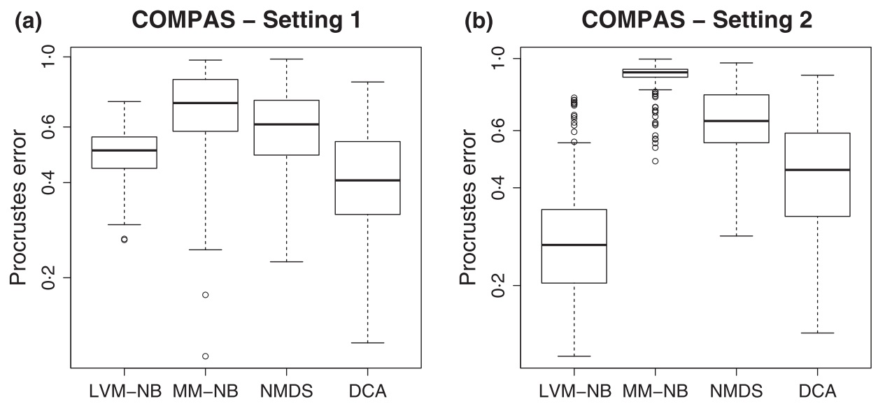

class: inverse, center, middle

# Latent Variable Models 

---

# Latent variable modles

- again models with latent variables 

--

- difference to CQO: latent variables are not based on **X**

--

- latent variables are estimated to optimally explain responses

--

- either after fitting them to predictors (constrained) or without predictors (unconstrained)

--

- initially drew inspiration from psychology  
  - item-response model  
  - latent trait model

---

# Random-effects ordination 
        
.footnote[Walker & Jackson (2011)]

- .blue[unconstrained] ordination through .blue[random effect] model  

--

$$\boldsymbol{Y} (N \times S) \rightarrow \boldsymbol{Y}^\prime (N \times R)$$

--
        
- For community data: $\hat{y_i} = a_s + \Sigma_s^S\beta_{sr}x_{is}$

--

- $a_s$ are species intercepts (mean abundances)   

--
        
- $\beta_{sr}$ are coefficients relating observed variables to axes (latent variables)

--
        
- assume: $x_{is} \sim N(0,1)$, i.e. x is a random effect 

--
        
- fit $\mathbf{B}$ and $x_i$ iteratively with ML 

--
        
- only presence-absence or normal distribution

--
        
- implemented in reo R package

---

.footnote[Walker & Jackson (2011)]
```{r reo-plot-1}
include_graphics("figures/walker2011_1.png", dpi = 120)
```

---

# Hui *et al.* 2015  

```{r hui15-figure-1}

```

--

`r fa("external-link-alt")` `r fa("external-link-alt", color = "white")` extend Walker & Jackson (2011) to GLMs 

--

\begin{align}
log(\mu_{is}) &= \alpha_i + \beta_{0s} + \eta_{i1} \lambda_{1s} + \eta_{i2}\lambda_{2s}\\
&=\alpha_i + \beta_{s} +\mathbf{\eta_i^T}\mathbf{\lambda_s}
\end{align}
--

$\alpha$ are *site effects*  
$\beta$ are species-specific intercepts (mean abundance)

--

Fit with ML 
---
# Hui *et al*. 2015 

```{r hui15-figure-2}

```

---

# BORAL

.footnote[Hui (2016b)]    

- **B**ayesian **O**rdination and **R**egression **A**na**L**ysis

--
        
- (un).blue[constrained] Ordination with .blue[MCMC] estimation 

--

\begin{align}
log(\mu_{is}) &= \alpha_i + \beta_{0s} + \mathbf{\eta_i^T}\mathbf{\lambda_s} & \text(Hui\ et\ al.\ 2015)\\
log(\mu_{is}) &= \alpha_i + \beta_{0s} + \mathbf{x_i}^T\boldsymbol{\beta_s} + \mathbf{\eta_i^T}\mathbf{\lambda_s} & \text(BORAL)\\
\end{align}

--

.content-box-blue[Priors]
- intercept: $\beta_{0s} \sim N(0,100)$
- $\theta \sim U(0,50)\ \forall\ \theta:0\notin \theta$, e.g. $\sigma^2$ or $\phi$
- $\eta$ are random effects so $\eta \sim N(0,1)$ (not a prior)  
- $\lambda_s; \alpha_i \sim N(0,20)$

---

# What do the latent variables represent? 

.footnote[Dormann *et al* (2018), Blanchet *et al.* (2020)]

- a spatial signal

- unmeasured environmental variables 

- a measure of co-occurrence ... 

--

- ... however: 

  - species occurrences depend on the environment  

--
        
  - indirect species associations   

--
        
  - interactions are often asymmetric 
  
---

# BORAL in Action
        

```{r read-boral-ucpo}
fit_unconstrained_po <-readRDS("../003_processed_data/boral_unconstrained_poisson.RDS")
pacman::p_load(boral, rjags, mvabund, UncertainOrd)
data(spider)
Y <- spider$abund
```
                
```{r boral-in-action,echo=T, eval=F}
# Unconstrained Ordination 
pacman::p_load(boral, rjags, mvabund, UncertainOrd)
data(spider)
Y <- spider$abund
fit_unconstrained_po <- boral(y = Y,
                              family = "poisson",
                              lv.control = list(num.lv = 2),
                              row.eff = "fixed",
                              save.model=TRUE)
summary(fit_unconstrained_po)
```
---

# BORAL in Action

.scroll-output[
```{r boral-in-action2}
summary(fit_unconstrained_po)
```
]

---

# Check model assumptions
        
```{r check-boral-ucpo,  fig.height=8, fig.width=8}
par(mfrow=c(2,2))
res <- capture.output(plot(fit_unconstrained_po))
```
---

# Check model assumptions - NB
```{r check boral 2, fig.height=8, fig.width=8}
fit_unconstrained_nb <-readRDS("../003_processed_data/boral_unconstrained_negbinom.RDS")
par(mfrow=c(2,2))
res = capture.output(plot(fit_unconstrained_nb))
```

---

# Ordination Diagram

```{r ordiplot boral 1, fig.height=8, fig.width=8}
suppressMessages(lvsplot(fit_unconstrained_nb))
```

---

# Constrained Ordination 

```{r boral load constrained}
fit_constrained_nb <- readRDS("../003_processed_data/boral_constrained_negbinom.RDS")
X <- scale(spider$x)
``` 

```{r boral fit constrained, echo=T,eval = F}
X <- scale(spider$x)

fit_constrained_nb <-
        boral(
                y = Y,
                X = X,
                family = "negative.binomial",
                lv.control = list(num.lv = 2),
                save.model = TRUE
        )

summary(fit_constrained_nb)
```

---

# Constrained Ordination 

.scroll-output[
```{r boral-fit-constrained-3}
summary(fit_constrained_nb)
```
]
  
---
# Ordination Diagram 

```{r ordiplot boral 2,  fig.height=8, fig.width=8}
suppressMessages(lvsplot(fit_constrained_nb))
```

---
# Correlation plots 
```{r boral correlation plots,fig.width=8, fig.height=8}
envcors <- get.enviro.cor(fit_constrained_nb)
par(mfrow=c(1,1))
corrplot(
        envcors$sig.cor,
        type = "lower",
        diag = FALSE,
        title =  "Correlations due to covariates",
        mar = c(3,0.5,2,1),
        tl.srt = 45)
```

---

# Correlation plots 

```{r boral correlation plots2, fig.width=8, fig.height=8}
rescors <- get.residual.cor(fit_constrained_nb)
corrplot(
        rescors$sig.cor,
        type = "lower",
        diag = FALSE,
        title =  "Residual correlations",
        mar = c(3, 0.5, 2, 1),
        tl.srt = 45
)
```

---

# Uncertainty in latent variable models
- R package UncertainOrd (Hoegh & Roberts, 2020)
- based on 95% credible intervals

```{r load uncertainord file}
uncertain_plot <- readRDS("../003_processed_data/boral_uncertainplot.RDS")
par(mfrow=c(1,1))
```

```{r, echo=FALSE, fig.height=6}
options(warn=-1)
uncertain_plot[[1]]$plot.obj
```

---
# Uncertainty in latent variable models
- R package UncertainOrd (Hoegh & Roberts, 2020)
- based on 95% credible intervals

```{r, echo=FALSE,  fig.height=6}
options(warn=-1)
uncertain_plot[[2]]$plot.obj
```

---

# Uncertainty in latent variable models
- R package UncertainOrd (Hoegh & Roberts, 2020)
- based on 95% credible intervals

```{r, echo=FALSE,  fig.height=6}
options(warn=-1)
uncertain_plot[[3]]$plot.obj
```

---

# Uncertainty in latent variable models
- R package UncertainOrd (Hoegh & Roberts, 2020)
- based on 95% credible intervals

```{r, echo=FALSE,  fig.height=6}
options(warn=-1)
uncertain_plot[[4]]$plot.obj
```

---

# Can we include traits in this? 
        
- as parameters for the priors  

$$\beta_{0s} \sim N(t_j^T \kappa_0, \mathbf{\sigma}^2_0)$$
$$\beta_{sp} \sim N(\mathbf{t_s^T \kappa_p, \sigma^2_p})$$
- The mean of the normal distribution from which species-specific intercept and regression coefficients are drawn depends on traits (t) and a trait coefficient $\kappa$. 

---

class:center,middle

\begin{align}
y_{is} &= a_i + \beta_{0s} + x^T \beta + \eta^T \lambda + \epsilon \\
a_i &\sim N(0,20) \\
\beta_{0s} &\sim N(\mu_{s}, \sigma^2_0)\\
\mu_{\beta_{0s}} &= t_s^T \kappa_0\\
\beta_{sp} &\sim N(\boldsymbol{\mu}_{\beta_{sp}},\boldsymbol{\Sigma})\\
\mu_{\beta_sp} &= t_s^T \kappa_{sp}\\
\lambda_s &\sim N(0,20)
\end{align}


---

# GLLVM package 


`r fa("r-project")` `r fa("r-project", color = "white")` package gllvm (Niku *et al.*, 2019b)

--

`r fa("exchange-alt")` `r fa("r-project", color = "white")` Maximum Likelihood instead of MCMC 

--

`r fa("tachometer-alt")` `r fa("r-project", color = "white")` faster than boral!

--

`r fa("exclamation-triangle")` `r fa("r-project", color = "white")` no posterior, no UncertainOrd


---

```{r gllvm-in-action-1-show, eval = F, echo=T}
pacman::p_load(gllvm, corrplot,gclus)
data("antTraits")
y <- as.matrix(antTraits$abund)
X <- scale(as.matrix(antTraits$env))
TR <- antTraits$traits
fit_uo_po <- gllvm(y, family = poisson())
fit_uo_nb <- gllvm(y, family = "negative.binomial")
```

```{r gllvm-in-action-1-do}
pacman::p_load(gllvm, corrplot,gclus)
data("antTraits")
y <- as.matrix(antTraits$abund)
X <- scale(as.matrix(antTraits$env))
TR <- antTraits$traits
fit_uo_po <- readRDS("../003_processed_data/gllvm/anttraits/fit_model_uo_po.RDS")
fit_uo_nb <- readRDS("../003_processed_data/gllvm/anttraits/fit_model_uo_nb.RDS")
```

--

```{r gllvm-summary}
fit_uo_po
```

---

# Unconstrained ordination

.scroll-output[
```{r gllvm-in-action-2, fig.width=8, fig.hight=8 }
par(mfrow = c(1,2))
plot(fit_uo_nb, which = 1)
plot(fit_uo_po, which = 1)
plot(fit_uo_nb, which = 2)
plot(fit_uo_po, which = 2)
plot(fit_uo_nb, which = 3)
plot(fit_uo_po, which = 3)
```
]

---
# gllvm Biplot  
```{r gllvm-uc-biplot,fig.height=8, fig.width=8}
ordiplot(fit_uo_nb,
         biplot = TRUE,
         ind.spp = 15,
         xlim = c(-3,3) ,
         ylim = c(-2, 1.6))
```

---

# Constrained Ordination 

```{r gllvm-in-action-3-show, eval = F, echo=T}
fit_co_nb2 <- gllvm(y, X, num.lv = 2,
                    formula = ~ Bare.ground + Shrub.cover +
                            Volume.lying.CWD,
                    family = "negative.binomial")
fit_co_nb3 <- gllvm(y, X, num.lv = 3,
                    formula = ~ Bare.ground + Shrub.cover +
                            Volume.lying.CWD,
                    family = "negative.binomial")
AIC(fit_co_nb2, fit_co_nb3)
```

```{r gllvm-in-action-3-do, echo = F}
fit_co_nb2 <- readRDS("../003_processed_data/gllvm/anttraits/fit_model_co_nb_2.RDS")
fit_co_nb3 <- readRDS("../003_processed_data/gllvm/anttraits/fit_model_co_nb_3.RDS")
AIC(fit_co_nb2, fit_co_nb3)
```

---

# Biplot of constrained ordination 
```{r gllvm-co-biplot, fig.height=8, fig.width=8}
ordiplot(fit_co_nb2, biplot = T)
```

---

# Coefficient plot 

```{r gllvm-co-coefficient-plot, fig.width = 10, fig.height=7}
coefplot(fit_co_nb2, cex.ylab = 0.7, mar = c(4,9,2,1),
         xlim.list = list(NULL, NULL, c(-4,4)))
```

---

# Residual Correlation plot 
```{r gllvm-residual-correlation-plot,fig.height=8, fig.width=8}
par(mfrow = c(1,1))
cr <- getResidualCor(fit_co_nb2)
corrplot(cr[order.single(cr),
            order.single(cr)],
         diag = FALSE,
         type = "lower",
         method = "square",
         tl.cex = 0.8,
         tl.srt = 45,
         tl.col = "red")
```

---

# Including traits 

```{r fitting-4th-corner-gllvm-show, eval = F, echo=T}
fit_4th <- gllvm(
        y = y,
        X = X,
        TR = TR,
        family = "negative.binomial",
        num.lv = 2,
        formula = y ~
                (Bare.ground + Shrub.cover + Volume.lying.CWD) +
                (Bare.ground + Shrub.cover + Volume.lying.CWD):(Pilosity + Polymorphism + Webers.length)
)
```

```{r fitting-4th-corner-gllvm-do}

fit_4th <- readRDS("../003_processed_data/gllvm/anttraits/fit_model_trait_co_nb_r2.RDS")
  
```

---

# Fourth Corner Interaction Plot
```{r gllvm-fourth-corner-interaction-plot,fig.height=8, fig.width=8}
fourth <- fit_4th$fourth.corner
colort <- colorRampPalette(c("blue", "white", "red"))
a <- max( abs(fourth) )
plot.4th <- lattice::levelplot((as.matrix(fourth)), xlab = "Environmental Variables",
                               ylab = "Species traits", col.regions = colort(100), cex.lab =1.3,
                               at = seq(-a, a, length = 100), scales = list(x = list(rot = 45)))
plot.4th
```

---

# Do Traits matter here? 
```{r gllvm-traits-matter, eval=F, echo=T}
fit_4th2 <- gllvm(y, X, TR, family = "negative.binomial", 
                  num.lv = 2, formula = y ~ (Bare.ground + 
                  Shrub.cover + Volume.lying.CWD))
anova(fit_4th, fit_4th2)
```

```{r gllvm-traits-matter2}
fit_4th2 <- readRDS("../003_processed_data/gllvm/anttraits/fit_model_traits_not_co_nb_2.RDS")
```
--
```{r gllvm-traits-matter3}
trait_anova = readRDS("../003_processed_data/gllvm/anttraits/anova_traits.RDS")
trait_anova
```

---
        
# Quadratic Latent variables 
.footnote[van der Veen *et al.* (2020)]

`r fa("exclamation-triangle")` `r fa("r-project", color = "white")` preprint 

--

- different tolerances between species and latent variables 

--

- measure of gradient length  (c.f. DCA)

```{r gllvm-van-der-veen}
include_graphics("figures/vanderveen2020.png", dpi = 300)
```
