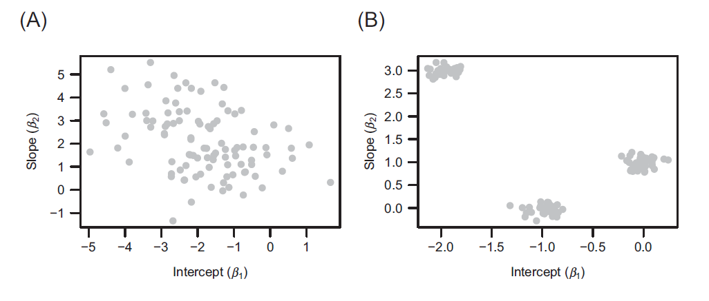

class: inverse, center, middle 

# Hierarchical modeling of species communities 

---

background-image: url("figures/Elith2007_1.png")
background-size: 900px
background-position: 50% 50%

# Species Distribution Models

.footnote[Elith *et al.* (2009)]

---

# Species Distribution Models
        
- aka
  - niche models (Peterson *et al.* 2011)
  - environmental models (Guisan *et al*. 2017)
  - habitat suitability models (Guisan *et al*. 2017)
  - envelope models (Hijmans & Graham 2006)

--

- model the realized niche of taxa


---

background-image: url("figures/zurell2020-1.png")
background-size: 800px
background-position: 50% 50%

# Species Distribution Models

.footnote[Zurell *et al.* (2020)]

---

# Biotic Interactions
        
`r fa("kiwi-bird")``r fa("exclamation", color = "white")` biotic interactions influence realized niche (Wisz *et al.*, 2013)

--
        
- limit range to that of another species (Schweiger *et al.*, 2012)

--
        
- use species at predictor variables (Leathwick & Austin, 2001)

--
        
- use residual correlation of latent variables (Pollock *et al.* 2014)

--
        
`r fa("long-arrow-alt-right")``r fa("exclamation", color = "white")` same as latent models before   

`r fa("long-arrow-alt-right")``r fa("exclamation", color = "white")` Joint Species Distribution Model 

---
        
# Are jSDMs worth the trouble? 
        
- alternative is called stacked SDM (many single species models)

--
        
- many studies compare predictive performance 

--
        
- jSDMs better if many rare species present (Norberg *et al.*, 2019)

--
        
- no difference in performance (Zurell *et al.*, 2019)

--
        
- community level models:  
  - "predict first, assemble later" vs. "assemble first, predict later" 

--
        
- clm outperform stacked models slightly (Maguire *et al.*, 2016)

--
        
- clm perform poorly (Baselga & Araújo, 2010)

---

# HMSC
        
- Hierarchical modeling of species communities 

--
        
- bayesian hierarchical multivariate mixed effect model

--
        
- .blue[bayesian]: fit with MCMC

--
        
- .blue[hierarchical]: some model parameters are modeled themselves 

--
        
- .blue[multivariate]: multiple response variables 

--
        
- .blue[mixed effect]: includes fixed and random effects

---

.footnote[Ovaskainen *et al.* (2017a)]      

# HMSC

```{r HMSC-IMAGE-1}
include_graphics("figures/ovaskainen2017_1.png", dpi = 100)
```

---

# HMSC

```{r HMSC-IMAGE-2}
include_graphics("figures/ovaskainen_abrego_2020-1.png", , dpi = 120)
```

.footnote[Ovaskainen & Abrego (2020)]

---

# HMSC - Single Species Example
        
```{r hmsc-ss-load, results='hide'}
library(Hmsc)
data.directory = "../001_raw_data/hmsc_birds/data/"
model.directory = "../003_processed_data/hmsc_mcmc/"
data = fread(file.path(data.directory, "data.csv"), stringsAsFactors = TRUE)
data = data[Year == 2014]
data %<>% droplevels()
xy = as.matrix(data[, c("x", "y")])
studyDesign = data.frame(route = factor(data$Route))
rownames(xy) = studyDesign[, 1]
```

```{r hmsc-ss-show-data}
data %>%
        head() %>%
        kable(format = "html") %>%
        kable_minimal() %>%
        scroll_box(height = "300px", width = "800px")
```

---

# HMSC - Single Species Example
```{r hmsc-ss-define-full-model, echo = T}
m_full = Hmsc(
  Y = as.matrix(data$Corvus_monedula),
  XData = as.data.frame(data[, c("Habitat", "AprMay")]),
  XFormula =  ~ Habitat + poly(AprMay, degree = 2, raw = TRUE),
  distr = "lognormal poisson",
  studyDesign = data.frame(route = factor(data$Route)),
  ranLevels = list(route = HmscRandomLevel(sData = xy))
)
```

--
        
.blue[**lognormal poisson?**]

--
        
- instead of negative binomial
- Poisson: $y_i \sim Poisson(exp(L_i))$
- lognormal Poisson: $y_i \sim Poisson(exp(L_i + \epsilon_i)), \ \epsilon \sim N(0, \sigma^2)$ 
        
---

# Fit model with MCMC

```{r fit-ss-hmsc, eval=F, echo = T}
nChains = 2
thin = c(5, 10, 100)
nParallel = max(round(parallel::detectCores() / 2), nChains)
samples = 1000
transient = 500 * thin
verbose = 500 * thin

for (i in 1:3) {
  m_full_fit = sampleMcmc(
    m_full,
    thin = thin[i],
    samples = samples,
    transient = transient,
    nChains = nChains,
    verbose = verbose,
    initPar = "fixed effects"
  )
}
```

```{r hmsc-load-ss-model}
files = fs::dir_ls(file.path(model.directory, "corvusmonedula"))
name_id = c(10, 100, 5)
for (i in seq_along(files)) {
  assign(x = paste0("models", name_id[i]),
         value = readRDS(files[i]))
}
rm(files, name_id)
mpost1 = convertToCodaObject(models5[[1]],
                             spNamesNumbers = c(T, F),
                             covNamesNumbers = c(T, F))
mpost2 = convertToCodaObject(models10[[1]],
                             spNamesNumbers = c(T, F),
                             covNamesNumbers = c(T, F))
mpost3 = convertToCodaObject(models100[[1]],
                             spNamesNumbers = c(T, F),
                             covNamesNumbers = c(T, F))
```

---

# thinning=5

.scroll-output[
```{r hmsc-ss-beta-plot1,  fig.height=9, fig.width=9}
plot(mpost1$Beta)
```
]

---
        
# thinning=10
.scroll-output[
```{r hmsc-ss-beta-plot2,fig.height=9, fig.width=9}
plot(mpost2$Beta)
```
]

---

# thinning=100
.scroll-output[
```{r hmsc-ss-beta-plot3, fig.height=9, fig.width=9}
plot(mpost3$Beta)
```
]

---

# Other MCMC convergence metrics

.blue[**Effective sample size**]

```{r hmsc-ss-effective-sample-size}
rm(mpost1, mpost2)
ess.beta = effectiveSize(mpost3$Beta)
temp = data.frame (ess = ess.beta)
vc_names_ess = names(ess.beta)
vc_names_ess %<>%
        stringr::str_remove("^B\\[") %>%
        stringr::str_remove(", Corvus monedula\\]")
rownames(temp) = vc_names_ess
temp %>%
        kable(format = "html") %>%
        kable_minimal %>%
        scroll_box(height = "200px", width = "800px")
rm(ess.beta, temp, vc_names_ess)
```

--
        
.blue[**potential scale reduction factor**] 

```{r hsmsc-ss-psrf}
psrf.beta = gelman.diag(mpost3$Beta,
                        multivariate = FALSE)$psrf
vc_names_psrf = rownames(psrf.beta)
vc_names_psrf %<>%
        stringr::str_remove("^B\\[") %>%
        stringr::str_remove(", Corvus monedula\\]")
rownames(psrf.beta) = vc_names_psrf
psrf.beta %>%
        as.data.frame %>%
        kable(format = "html") %>%
        kable_minimal %>%
        scroll_box(height = "200px", width = "800px")
rm(psrf.beta, vc_names_psrf)
```

---

# Cross-Validation Performance 
```{r hmsc-ss-predictive-performance}

preds = computePredictedValues(models100[[1]], expected = FALSE)
MF = evaluateModelFit(hM = models100[[1]], predY = preds)

MF %>%
        unlist %>%
        as.data.frame() %>%
        kable(format = "html") %>%
        kable_minimal() %>%
        scroll_box(height = "300px", width = "800px")
```

--
        
.blue[**O**] - Occurrence, .blue[**C**] - Count

--
        
.blue[**SR**]: pseudo- $R^2$ based on squared spearman correlation  

--
        
.blue[**AUC**]: Area under Curve - higher = better   

--
        
.blue[**TjurR2**]: $\bar{\hat{y_i}}- \bar{\hat{y_j}}, \forall y_i = 1 \land  y_j = 0$

---

# Variance Partioining

```{r hmsc-ss-design}
groupnames = c("habitat", "climate")
group = c(1, 1, 1, 1, 1, 2, 2)
VP = computeVariancePartitioning(models100[[1]],
                                 group = group,
                                 groupnames = groupnames)
VP$vals %>%
        as.data.frame() %>%
        kable(format = "html") %>%
        kable_minimal %>%
        scroll_box(height = "180px", width = "800px")
```

---

# Spatial Prediction 
        
```{r hmsc-ss-load-pred}
library(abind)
predY = readRDS("../003_processed_data/hmsc_mcmc/corvusmonedula/prediction.RDS")
EpredY = apply(abind(predY, along = 3), c(1, 2), mean)
EpredO = apply(
        abind(predY, along = 3),
        c(1, 2),
        FUN = function(a) {
                mean(a > 0)
        }
)
grid = read.csv(file.path(data.directory,
                          "grid_1000.csv"))
grid = droplevels(subset(grid,!(Habitat == "Ma")))
xy.grid = as.matrix(cbind(grid$x, grid$y))
mapData = data.frame(xy.grid, EpredY, EpredO)
names(mapData) = c("xCoordinates",
                   "yCoordinates",
                   "PredictedAbundance",
                   "PredictedOccurence")
spC <- ggplot(data = mapData,
              aes(x = xCoordinates,
                  y = yCoordinates,
                  color = PredictedAbundance)) +
        geom_point(size = 2)
spO <- ggplot(data = mapData,
              aes(x = xCoordinates,
                  y = yCoordinates,
                  color = PredictedOccurence)) +
        geom_point(size = 2)
```

```{r hmsc-ss-pred-fig1, fig.height=8, fig.width=8}
spO +
  ggtitle("Predicted Corvus monedula occurrence") +
  xlab("East coordinate (km)") +
  ylab("North coordinate (km)") +
  scale_color_gradient(low = "blue",
                       high = "red",
                       name = "Occurrence probability") +
  theme(legend.position = "none")
```

---

# Spatial Prediction 

```{r hmsc-ss-pred-fig2,fig.height=8, fig.width=8}
spC +
        ggtitle("Predicted Corvus monedula abundance") +
        xlab("East coordinate (km)") +
        ylab("North coordinate (km)") +
        scale_color_gradient(low = "blue",
                             high = "red",
                             name = "Abundance") +
        theme(legend.position = "none")
```

---

# Joint Modeling with HMSC 

.footnote[Ovaskainen & Abrego (2020)]

All regression parameters for species $s$ are drawn from: 
.center[
$\boldsymbol{\beta}_{.s} \sim N(\boldsymbol{\mu}, \mathbf{V})$  
]

--

Parameters are not species specific.

\begin{align}
\beta_{1s} &\sim N(\mu_1, \boldsymbol{V_1}) \\
\beta_{2s} &\sim N(\mu_2, \boldsymbol{V_2})
\end{align}

--

```{r HMSC-IMAGE-niches}

```

---

# Including traits in the model

.footnote[Ovaskainen & Abrego (2020)]

.pull-left[
        Species specific expected value:
        $$\boldsymbol{\beta}_{.s} \sim N(\boldsymbol{\mu_{.s}}, \mathbf{V})$$
        Modeled as regression to traits
        $$\mu_{ps} = \Sigma_{j=1}^{J} t_{sj}\gamma_{pj}$$
]


.pull-right[
        $t_{sj}$ - trait $j$ of species $s$  
        $\gamma_{pj}$ - influence of trait $j$ on how species are expected to respond to covariate $p$  
]

--

```{r HMSC-IMAGE-niches2}
include_graphics("figures/ovaskainen_abrego_2020-3.png", dpi = 200)
```

---
        
# Inlcuding Phylogeny 

.footnote[Ovaskainen (2020)]

```{r img-hmsc-phylo}
include_graphics(path = "figures/ovaskainen_course_2.png", dpi = 120)
```


---

.footnote[Ovaskainen (2020)]     
        
# Inlcuding Phylogeny 

```{r img-hmsc-phylo2}
include_graphics(path = "figures/ovaskainen_course_3.png", dpi = 120)
```

---

# How to include phylogeny? 
        
- add family or order as .blue[categorical variable]

--
  - does not scale well 

--

  - some families are more similar to each other than others 

--

- a .blue[phylogenetic tree] is the best representation 

--

- we can summarize a tree with a .blue[phylogenetic correlation matrix] $\boldsymbol{C}$

--

- HMSC uses $\boldsymbol{C}$ to include phylogeny 

--

- $\boldsymbol{C}$ is S $\times$ S matrix 

--

- $c_{ij}$ is the .blue[shared evolutionary time]

---

.footnote[Felsenstein (1985), Ives & Helmus (2011)]

# How to include phylogeny? 

One environmental variable and fully phylogenetically structured covariance  
$$\beta \sim N(\mu, C)$$
        
--

No phylogenetic structure in covariance  

$$\beta \sim N(\mu, I)$$

--

Middle option implemented in HMSC
$$\beta \sim N(\mu, W)$$
$$W = \rho C + (1-\rho)I$$
$0 \le \rho \le 1$ - the strength of the phylogenetic signal

---

class:center,middle

# The Kronecker Product
        

$\begin{bmatrix}1 & 2\\3 & 4\\\end{bmatrix} \otimes \begin{bmatrix}1 & 2\\3 & 4\\\end{bmatrix} =$ 
        $\begin{bmatrix} 1 \begin{bmatrix} 5 & 6  \\7 & 8  \\\end{bmatrix}& 2 \begin{bmatrix} 5 & 6  \\7 & 8  \\\end{bmatrix} \\3 \begin{bmatrix} 5 & 6  \\7 & 8  \\\end{bmatrix}& 4\begin{bmatrix} 5 & 6  \\7 & 8  \\\end{bmatrix}  \\\end{bmatrix} =$
        $\begin{bmatrix}5 & 6 & 10 & 12 \\7 & 8 & 14 & 16 \\15 & 18 & 20 & 24 \\21 & 24 & 28 & 32 \\\end{bmatrix}$
  


---

# How to include phylogeny?
        
$$\boldsymbol{\beta} \sim N(\mu, \mathbf{W} \otimes \mathbf{V})$$   
--
        
$\mathbf{W} \otimes \mathbf{V}$ gives a PS $\times$ PS matrix  

--
        
$\mathbf{W}$ is a S $\times$ S matrix of species to species covariances 
$\mathbf{W} = \begin{bmatrix} w_{11} & w_{12} & w_{13} \\ w_{21} & w_{22} & w_{23} \\ w_{31} & w_{32} & w_{33} \\  \end{bmatrix}$ = 
$\begin{bmatrix} 1 & 0.8 & 0.4 \\ 0.8 & 1 & 0 \\ 0.4 & 0 & 1 \\ \end{bmatrix}$
        
--
        
$\mathbf{V}$ is a P $\times$ P matrix of covariance between responses towards environmental variables  
$\mathbf{V} = \begin{bmatrix} v_{11} & v_{12}\\ v_{21} & v_{22}\\  \end{bmatrix}$ = 
$\begin{bmatrix} 1 & -0.2 \\ -0.2 & 1\\\end{bmatrix}$
        
---

$$\mathbf{W} \otimes \mathbf{V} =\begin{bmatrix} 1 & 0.8 & 0.4 \\ 0.8 & 1 & 0 \\ 0.4 & 0 & 1 \\ \end{bmatrix} \otimes \begin{bmatrix} 1 & -0.2 \\ -0.2 & 1\\\end{bmatrix}$$

--

$$=\begin{bmatrix} 1 \begin{bmatrix} 1 & -0.2 \\ -0.2 & 1 \end{bmatrix}  & 0.8 \begin{bmatrix} 1 & -0.2 \\ -0.2 & 1 \end{bmatrix} & 0.4 \begin{bmatrix} 1 & -0.2 \\ -0.2 & 1 \end{bmatrix}\\ 0.8 \begin{bmatrix} 1 & -0.2 \\ -0.2 & 1 \end{bmatrix}  & 1 \begin{bmatrix} 1 & -0.2 \\ -0.2 & 1 \end{bmatrix} & 0 \begin{bmatrix} 1 & -0.2 \\ -0.2 & 1 \end{bmatrix} \\ 0.4 \begin{bmatrix} 1 & -0.2 \\ -0.2 & 1 \end{bmatrix}  & 0 \begin{bmatrix} 1 & -0.2 \\ -0.2 & 1 \end{bmatrix} & 1 \begin{bmatrix} 1 & -0.2 \\ -0.2 & 1 \end{bmatrix}\end{bmatrix}$$

--

$$=\begin{bmatrix} 1 & -0.2 & 0.8 & -0.16 & 0.4 & -0.08 \\ -0.2  & 1 & -0.16 & 0.8 & -0.08 &  0.4 \\ 0.8   & -0.16 & 1 & -0.2 & 0 & 0 \\ -0.16 & 0.8 & -0.2 & 1 & 0 &0 \\ 0.4   & -0.2 & 0 &  0 & 1 & -0.2 \\ -0.08 & -0.2 & 0 &0 & -0.2 & 1 \end{bmatrix}$$
---

.footnote[Ovaskainen & Abrego (2020)]

```{r img-hmsc-overview}
include_graphics(path = "figures/ovaskainen_abrego_2020-1-mod.png", dpi = 180)
```

---

```{r img-hmsc-overview-study-design}
include_graphics(path = "figures/ovaskainen_abrego_2020-1-mod-study-desgin.png", dpi = 180)
```

---

.footnote[Ovaskainen *et al.* (2017a)]

# $\Pi$ Study Design 

```{r HMSC-IMAGE-OVASKAINEN-2017b-2}
include_graphics("figures/ovaskainen2017_2.png", dpi = 150)
```


---

```{r img-hmsc-overview-spatial-coordinates}
include_graphics(path = "figures/ovaskainen_abrego_2020-1-mod-spatial-coordinates.png", dpi = 180)
```

---

```{r img-hmsc-overview-eta-gamma}
include_graphics(path = "figures/ovaskainen_abrego_2020-1-mod-eta_and_gamma.png", dpi = 180)
```

---

# Random effects - $H$ and $\Lambda$
       
.footnote[Bhattacharya and Dunson (2011)]
$$L_{is} = L_{is}^{\mathbf{F}ixed} + L_{is}^{\mathbf{Ra}ndom}$$
--
        
.content-box-blue[**Random effects**] 
$$L^{Ra}_{ij} = \Sigma_{r=1}^{R} \eta_{ir}\lambda_{rs}$$
$$\boldsymbol{L}^{Ra} = \boldsymbol{H}\boldsymbol{\Lambda}$$

--
        
$\eta$  .blue[site loading]  
$\eta \sim N(0,1)$    

--

$\lambda$  .blue[species loading]  
$\lambda \sim$ multiplicative gamma process shrinkage prior 

---
class: middle,center

\begin{align}
\eta &\sim N(0,1)
\end{align}

---
class: middle,center

\begin{align}
\eta &\sim N(0,1)\\
Cov[L^{Ra}_{i_1s_1}L^{Ra}_{i_2s_2}] &= \Sigma_{r=1}^{R} \lambda_{rs_1}\lambda_{rs_2}\delta_{i_1i_2}\\
\end{align}

---
class: middle,center

\begin{align}
\eta &\sim N(0,1)\\
Cov[L^{Ra}_{i_1s_1}L^{Ra}_{i_2s_2}] &= \Sigma_{r=1}^{R} \lambda_{rs_1}\lambda_{rs_2}\delta_{i_1i_2}\\
L_{i\cdot}^{Ra} &\sim N(0, \boldsymbol{\Omega})\\
\end{align}

---
class: middle,center

\begin{align}
\eta &\sim N(0,1)\\
Cov[L^{Ra}_{i_1s_1}L^{Ra}_{i_2s_2}] &= \Sigma_{r=1}^{R} \lambda_{rs_1}\lambda_{rs_2}\delta_{i_1i_2}\\
L_{i\cdot}^{Ra} &\sim N(0, \boldsymbol{\Omega})\\
\boldsymbol{\Omega} &= \boldsymbol{\Lambda}^T\boldsymbol{\Lambda}
\end{align}
                
---
class: middle,center

\begin{align}
\eta &\sim N(0,1)\\
Cov[L^{Ra}_{i_1s_1}L^{Ra}_{i_2s_2}] &= \Sigma_{r=1}^{R} \lambda_{rs_1}\lambda_{rs_2}\delta_{i_1i_2}\\
L_{i\cdot}^{Ra} &\sim N(0, \boldsymbol{\Omega})\\
\boldsymbol{\Omega} &= \boldsymbol{\Lambda}^T\boldsymbol{\Lambda}\\
R_{s_1s_2} &= \dfrac{\Omega_{s_1s_2}}{\sqrt{\Omega_{s_1s_1} \Omega_{s_2s_2}}}
\end{align}

---

```{r img-hmsc-overview-study-design-spatial-scale}
include_graphics(path = "figures/ovaskainen_abrego_2020-1-mod-spatial-scale.png", dpi = 180)
```

---

# $\alpha$ Spatial scale parameter 

.content-box-blue[Spatial autocorrelation in a linear model]

$$y_i = L_i + \epsilon_i$$

--

$$\epsilon_i \sim N(0, \Sigma)$$
--

$$\Sigma_{i_1i_2} = \sigma^2_{space}\ exp(-d_{i_1i_2}/\alpha)$$
--

.content-box-blue[Spatial autocorrelation in a latent variable]  

.center[
$\boldsymbol{\eta}_{\cdot r} \sim N(0, \boldsymbol{\Sigma}_r)$ with $\boldsymbol{\Sigma}_{r,i_1i_2} = exp(-d_{i_1i_2}/\alpha)$  
]

--

$$Cov[L^{Ra}_{i_1s_1}L^{Ra}_{i_2s_2}]
= \Sigma_{r=1}^{R} \lambda_{rs_1}\lambda_{rs_2}exp(-d_{i_1i_2}/\alpha)$$

---

# JSDM with HMSC 
```{r hmsc-jsdm-setup, echo=T}
# directories
dir = list(data = here("001_raw_data/hmsc_birds/data/"),
           model = here("003_processed_data/hmsc_mcmc/jsdm"))

# load bio and environment data 
dt_y = data.table::fread(file.path(dir$data, "data.csv"))
dt_x = dt_y[,c(5,6,7,8,9)]
# load phylogenetic data
ph_phylo <- ape::read.tree(file.path(dir$data, "CTree.tre"))
# load traits
dt_traits = fread(file.path(dir$data, "traits.csv"))
dt_traits$LogMass = log(dt_traits$Mass)
```

---
        
# Phylogenetic data
.scroll-output[
```{r phylo-data, echo =T }
ph_phylo
```
]

---

# Phylogenetic data

```{r hmsc-jsdm-phylo-plot}
ggtree(ph_phylo, branch.length="none", layout="circular") +
        geom_tiplab(align=TRUE, linesize=.5)
```

---

# Trait data

```{r hmsc-jsdm-traits}
dt_traits %>%
        head() %>%
        kable(format="html") %>%
        kable_minimal() %>%
        scroll_box(width="800px")
```

```{r hmsc-jsdm-common-species}
vc_subset = sort(colSums(dt_y[,10:59]), decreasing = TRUE)
vc_subset = names(vc_subset)[1:9]
vc_subset = append(vc_subset, "Corvus_monedula")
vc_subset = which(names(dt_y) %in% vc_subset)

dt_y=dt_y[,append(1:9, vc_subset), with = F]
ma_y=as.matrix(dt_y[,10:19])
# reduce trait data to selected species
dt_traits = dt_traits[Species %in% colnames(dt_y)]
```

---

# Study Design 

```{r hmsc-jsdm-study-design, echo = T}
ma_studydesign           = matrix(NA, nrow = nrow(ma_y), ncol = 2)
ma_studydesign[,1]       = sprintf('Route_%.3d',dt_y$Route)
ma_studydesign[,2]       = sprintf('Year_%.3d',dt_y$Year)
df_studydesign           = as.data.frame(ma_studydesign)
colnames(df_studydesign) = c("Route","Year")
df_studydesign[,1]       = as.factor(df_studydesign[,1])
df_studydesign[,2]       = as.factor(df_studydesign[,2])
```

--
        
```{r hmsc-jsdm-study-design2}
df_studydesign %>%
        head() %>%
        kable(format="html") %>%
        kable_minimal() %>%
        scroll_box(width="800px")
```

---
# Random Effect Structure 
        
```{r HMSC-jsdm-random-effect-structure, echo=T}
# Vector of Route names
vc_routes  = levels(df_studydesign[,1])
# Create matrix that will hold route coordinates
ma_xy      = matrix(0,
                    nrow = length(vc_routes),
                    ncol = 2)
# Fill ma_xy with mean coordiantes of all observations that belong to a route
for (i in seq_along(vc_routes)){
        rows       = df_studydesign[,1]==vc_routes[i]
        ma_xy[i,1] = mean(dt_y[rows,]$x)
        ma_xy[i,2] = mean(dt_y[rows,]$y)
}

colnames(ma_xy) = c("x","y")
rownames(ma_xy) = vc_routes
# Create spatial random level 
rL = HmscRandomLevel(sData=ma_xy)
# Minimum and maximum number of latent variables 
rL$nfMin = 5
rL$nfMax = 10
```

---
        
# Defining the model 
        
```{r hmsc-jsdm-defining-the-model, echo = T}

XFormula  = ~ Habitat + poly(AprMay, degree = 2, raw = TRUE)
TrFormula = ~ Migration + LogMass

m = Hmsc(Y = ma_y,
         XData = as.data.frame(dt_x),
         XFormula = XFormula,
         TrData = dt_traits,
         TrFormula = TrFormula,
         phyloTree = ph_phylo,
         distr = "lognormal poisson",
         studyDesign = df_studydesign,
         ranLevels = list(Route=rL))
```

---

# MCMC convergence 
        
```{r hmsc-jsdm-load-mcmc}
m_fit = readRDS("~/01_Uni/01_Lehre/05_MOD3-Lecture/003_processed_data/hmsc_mcmc/jsdm/model_5.RDS")
mpost = convertToCodaObject(m_fit,
                            spNamesNumbers = c(T, F),
                            covNamesNumbers = c(T, F))
```

.scroll-output[
```{r hmsc-jsdm-plot-mcmc, fig.width=8}
plot(mpost$Beta)
```
]

---

.scroll-output[
```{r hmsc-jsdm-plot-mcmc-sigma, fig.width=8}
plot(mpost$Sigma)
```
]

---
# Effective Sample size
```{r hmsc-jsdm-eff}
es.beta  = effectiveSize(mpost$Beta)
ge.beta  = gelman.diag(mpost$Beta,multivariate=FALSE)$psrf
es.gamma = effectiveSize(mpost$Gamma)
ge.gamma = gelman.diag(mpost$Gamma,multivariate=FALSE)$psrf
es.rho = effectiveSize(mpost$Rho)
ge.rho = gelman.diag(mpost$Rho,multivariate=FALSE)$psrf
es.V = effectiveSize(mpost$V)
ge.V = gelman.diag(mpost$V,multivariate=FALSE)$psrf
es.omega = effectiveSize(mpost$Omega[[1]])
ge.omega = gelman.diag(mpost$Omega[[1]],multivariate=FALSE)$psrf
ge = list(
        beta = ge.beta,
        gamma = ge.gamma,
        V      = ge.V,
        Omega = ge.omega
        
)
es =  list(
        beta = es.beta,
        gamma = es.gamma,
        V = es.V,
        Omega = es.omega
)
par(mfrow=c(2,2))
for (i in seq_along(es)){
        vioplot(es[[i]], main = names(es)[i])
}

```

---
        
# Gelman Diagnostic 
        
```{r hmsc-jsdm-gelman-diagnostic-plots}
par(mfrow=c(2,2))
for (i in seq_along(ge)){
        vioplot(ge[[i]][,1], main = names(ge)[i])
}
```


---
# Evaluate model fit 
```{r hmsc-jsdm-model-fit-read}
predY = readRDS("~/01_Uni/01_Lehre/05_MOD3-Lecture/003_processed_data/hmsc_mcmc/jsdm/prediction.RDS")
MF    = readRDS("~/01_Uni/01_Lehre/05_MOD3-Lecture/003_processed_data/hmsc_mcmc/jsdm/model_fit.RDS")
hmsc_eval = data.frame (species = colnames(predY), 
                        RMSE = MF$RMSE,
                        SR2 = MF$SR2,
                        O.AUC = MF$O.AUC,
                        O.TjurR2 = MF$O.TjurR2,
                        O.RMSE = MF$O.RMSE,
                        C.SR2 = MF$C.SR2,
                        C.RMSE = MF$C.RMSE
)

```

```{r hmsc-jsdm-show-eval}
hmsc_eval%>%
        head() %>%
        kable(format="html") %>%
        kable_minimal() %>%
        scroll_box(width="800px")
```

---

# Variation Partitioning 
        
```{r hmsc-jsdm-variation-partitioning}
VP = computeVariancePartitioning(m_fit)
plotVariancePartitioning(hM=m_fit, 
                         VP=VP,
                         cols = rainbow(nrow(VP$vals)), 
                         args.leg=list(bg="white",cex=0.7),
                         main = paste0("Proportion of explained variance",cex.main=0.8))
```

---

# Beta plot 

```{r hmsc-jsdm-beta-plot}
# postBeta = getPostEstimate(m_fit, parName="Beta")
# plotBeta(m, post=postBeta, supportLevel = 0.95,param="Sign",
#          plotTree = !is.null(m_fit$phyloTree),
#          covNamesNumbers = c(TRUE,FALSE),
#          spNamesNumbers=c(TRUE,FALSE),
#          cex=c(0.6,0.6,0.8))
include_graphics("figures/R_hmsc_beta.png", dpi = 150)
```

---
# Gamma plot 
```{r hmsc-jsdm-gamma-plot}
# postGamma = getPostEstimate(m_fit, parName="Gamma")
# plotGamma(m_fit, post=postGamma, supportLevel = 0.9, param="Sign",
#           covNamesNumbers = c(TRUE,FALSE),
#           trNamesNumbers=c(TRUE,FALSE),
#           cex=c(0.6,0.6,0.8))
include_graphics("figures/R_hmsc_gamma.png", dpi = 150)
```

---

# Omega plot 
```{r hmsc-jsdm-omega-plot}
OmegaCor = computeAssociations(m_fit)
supportLevel = 0.95

plotOrder = corrMatOrder(OmegaCor[[1]]$mean, order = "AOE")
toPlot = ((OmegaCor[[1]]$support > supportLevel) + (OmegaCor[[1]]$support <
                                                            (1 - supportLevel)) > 0) * sign(OmegaCor[[1]]$mean)
mymain = paste0("Associations: ",names(m_fit$ranLevels)[[1]])

corrplot(
        toPlot[plotOrder, plotOrder],
        method = "color",
        col = colorRampPalette(c("blue", "white", "red"))(3),
        mar = c(0, 0, 1, 0),
        main = mymain,
        cex.main = 0.8,
        diag = FALSE,
        type = "lower"
)
```

---

# Make Predictions 
```{r hmsc-jsdm-prediction-plot-1}
predY = readRDS("../003_processed_data/hmsc_mcmc/jsdm/prediction2.RDS")
Gradient = constructGradient(m_fit, focalVariable="AprMay", non.focalVariables=list(Habitat=list("3", "Urb")))
par(mfrow=c(1,1))
plotGradient(m, Gradient, pred=predY, measure="S", las=1, showData = TRUE, main='Species richness (measure="S")')
```

---

# Make Predictions
```{r hmsc-jsdm-prediction-plot-2}
plotGradient(m, Gradient, pred=predY, measure="Y", index=1, las=1, showData = TRUE, main='Focal species occurrence (measure="Y")')
```

---

# Make Predictions
```{r hmsc-jsdm-prediction-plot-3}
plotGradient(m, Gradient, pred=predY, measure="T", index=3, las=1, showData = TRUE, main='Mean trait value (measure="T")')
```

---

# Interactions in multiple variables 
.footnote[Saine *et al.* 2020]
```{r hmsc-image-saine2020}
include_graphics("figures/saine2020.png", dpi = 250)
```