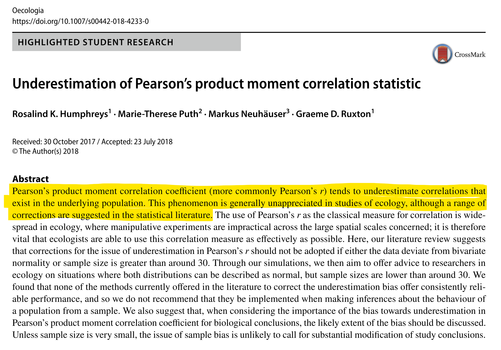

```{r}
if(!"call" %in% ls()) pacman::p_load(dplyr, ggplot2)
```

class: inverse, center, middle 
# Copulas 

---

.footnote[Sklar (1959)]

 # What are Copulas? 
 
- .blue[Copula] is latin and means .blue[a link, tie or bond]

--
 
- a Copula is a function $C()$ that .blue[couples] multiple marginal and one multivariate distribution 

--
        
- they combine $d$ .blue[marginal distributions] $F_1, ..., F_d$ to one d-dimensional .blue[multivariate distribution] $H()$
        
--
        
- Formally expressed in .blue[Sklar's Theorem]: 
$$ H(x_1,...x_d) = C(F_1(x_1), ..., F_d(x_d))$$
--

- the copula defines the .blue[dependence] between marginals

--

- copulas contain .blue[scale-free] dependence metrics

---

# Metrics of dependence 

```{r HUMPHREY-2017-1}

```

---

# Metrics of dependence 

```{r HUMPHREY-2017-2}

```

---

# Metrics of dependence 

```{r HUMPHREY-2017-3}

```

---

```{r COPULA-r-example}
library(copula)
library(grid)
set.seed(999)
n = 200
d = 2
normal <- normalCopula(param = 0.8, dim = d)
x_cop_mvn = mvdc(
        copula = normal,
        margins = c("norm", "norm"),
        paramMargins = list(list(mean = 0, sd = 1), list(mean = 0, sd = 1))
)
x_cop_exp = mvdc(
        copula = normal,
        margins = c("exp", "exp"),
        paramMargins = list(list(rate = 1), list(rate = 1))
)

n_samples <- rMvdc(n, x_cop_mvn) %>% data.frame()
x_samples <- rMvdc(n, x_cop_exp) %>% data.frame()

names(n_samples) = c("x1", "x2")
names(x_samples) = c("y1", "y2")

n_dens = n_samples %>% tidyr::pivot_longer(cols = c("x1", "x2"))
x_dens = x_samples %>% tidyr::pivot_longer(cols = c("y1", "y2"))
par(mfrow = c(1, 2))
p1 = ggplot(data = n_samples, aes(x = x1, y = x2)) + geom_point() + ggtitle(paste("Correlation x1-x2:", round(cor(
        n_samples[, 1], n_samples[, 2]
), 2)))
p2 = ggplot(data = x_samples, aes(x = y1, y = y2)) + geom_point() + ggtitle(paste("Correlation y1-y2:", round(cor(
        x_samples[, 1], x_samples[, 2]
), 2)))
pushViewport(viewport(layout = grid.layout(1, 2)))
print(p1, vp = viewport(layout.pos.row = 1, layout.pos.col = 1))
print(p2, vp = viewport(layout.pos.row = 1, layout.pos.col = 2))
```

---

```{r COPULA-EXAMPLE-2}
p1 = ggplot(data = n_dens, aes(x = value, fill = name, col = name)) + geom_density(alpha = 0.5) +
        ggtitle("Marginal distributions x1 and x2")
p2 = ggplot(data = x_dens, aes(x = value, fill = name, col = name)) + geom_density(alpha = 0.5) +
        ggtitle("Marginal distributions y1 and y2")
pushViewport(viewport(layout = grid.layout(1, 2)))
print(p1, vp = viewport(layout.pos.row = 1, layout.pos.col = 1))
print(p2, vp = viewport(layout.pos.row = 1, layout.pos.col = 2))
```

---

# Probability Transform 

```{r PIT-IMAGE}
include_graphics("figures/anderson2019_1_mod_1.png", dpi = 150)
```

---

# Probability Transform in R 


```{r prepare-PIT-IN-R-DO}
x = as.matrix(n_samples)
y = as.matrix(x_samples)
exp_cdf = ecdf(y)
mvn_cdf = ecdf(x)
y2 = matrix(exp_cdf(y), ncol = 2) %>% data.frame
x2 = matrix(mvn_cdf(x), ncol = 2) %>% data.frame

names(y2) = c("y1", "y2")
names(x2) = c("x1", "x2")
```

```{r PIT-IN-R-SHOW, eval=F, echo=T}
# define the (empirical) cumulative distribution function
mvn_cdf = ecdf(x)
# transform data 
x2 = matrix(mvn_cdf(x), ncol = 2)
```

```{r PIT-IN-R-PLOT, fig.height = 4}
p1 = ggplot(data = data.frame(x2), aes(x = x1, y = x2)) + geom_point() + ggtitle(paste("Correlation:", round(cor(x2[, 1], x2[, 2]), 2)))
p2 = ggplot(data = data.frame(y2), aes(x = y1, y = y2)) + geom_point() + ggtitle(paste("Correlation:", round(cor(y2[, 1], y2[, 2]), 2)))

pushViewport(viewport(layout = grid.layout(1, 2)))
print(p1, vp = viewport(layout.pos.row = 1, layout.pos.col = 1))
print(p2, vp = viewport(layout.pos.row = 1, layout.pos.col = 2))
```

---

# Quantile Transform 

```{r PIT-IMAGE2}
include_graphics("figures/anderson2019_1_mod_2.png", dpi = 100)
```

---

# Quantile Transform in R 

```{r prepare-QIT-IN-R}
x_qit    = qnorm(p = as.matrix(x2)) %>% data.frame
y_qit    = qnorm(p = as.matrix(y2)) %>% data.frame
names(x_qit) = c("x1", "x2")
names(y_qit) = c("y1", "y2")
x_qit <- x_qit[!is.infinite(rowSums(x_qit)),]
y_qit <- y_qit[!is.infinite(rowSums(y_qit)),]
```


```{r QIT-IN-R-SHOW, eval=F}
y_qit    = qnorm(p = y2) 
```


```{r QIT-IN-R-PLOT, fig.height=4}
p1 = ggplot(data = x_qit, aes(x=x1,y=x2)) + geom_point() + ggtitle(paste("Correlation:", round(cor(x_qit[,1], x_qit[,2]),2)))
p2 = ggplot(data = y_qit, aes(x=y1,y=y2)) + geom_point() + ggtitle(paste("Correlation:", round(cor(y_qit[,1], y_qit[,2]),2)))
pushViewport(viewport(layout = grid.layout(1, 2)))
print(p1, vp = viewport(layout.pos.row = 1, layout.pos.col = 1))
print(p2, vp = viewport(layout.pos.row = 1, layout.pos.col = 2))
```


---

# Coming back to Copulas 

- we can say x1 and x2 have the same copula as y1 and y2

--

.content-box-blue[independence copula]

$$ \Pi(u) = \prod_{j=1}^d u_j$$
--

why $u$ ? `r fa("arrow-right")` all $F(x)$ must be standard univariate! 

--

whats the probability of $x_1 \ge 0.5$ and $x_2 \ge 0.3$ ?   
$Pr(x_1 \ge 0.5) \times Pr(x_2 \ge 0.3)$

---

# Independence Copula in R 

```{r INDICOP-IN-R, echo =T}
library(copula)
# number of distributions 
d = 2
ic = indepCopula(dim = d)
(u = runif(d))
(Pi = pCopula(u, copula = ic))
Pi == prod(u)
```

---

# Independence Copula in R 
.scroll-output[
```{r INDICOP, fig.height=10, fig.width=10}
wireframe2(ic, FUN = pCopula, col.4 = adjustcolor("black", alpha.f =0.4))
contourplot2(ic, FUN = pCopula)
# pushViewport(viewport(layout = grid.layout(1, 2)))
# print(p1, vp = viewport(layout.pos.row = 1, layout.pos.col = 1))
# print(p2, vp = viewport(layout.pos.row = 1, layout.pos.col = 2))

```
]

---

# bivariate Frank Copula 
$$C_\theta^F (\mathbf{u}) = - \frac{1}{\theta}\ \log \bigg(1 + \frac{(exp(-\theta u_1)-1)(exp(-\theta u_2)-1)}{exp(-\theta)-1} \bigg)$$ 

- one parameter: $\theta \in \mathbb{R}\ \backslash\ \{0\}$
- $C_0^F = \Pi$ 
- $\theta$ controls the dependence between variables 

---

# Frank Copula in R 


```{r FRANKCOP, echo=FALSE, eval = T, message=F}
d = 2
para = -10:10
# fit a frank copula with each element of para 
fc = purrr::map(.x = para, .f = ~ frankCopula(param = .x, dim = d))
```
```{r COPULA-FRANK-SAVE-GIF, echo=FALSE, eval = FALSE}
para = round(seq(from=-10, to = 10, length.out = 50),2)
para2 = round(seq(from=10, to = -10, length.out = 50),2)
para = append(para, para2)
fc = purrr::map(.x = para, .f = ~ frankCopula(param = .x, dim = d))
saveGIF(
  expr = for (i in seq_along(para)){
    persp(fc[[i]], dCopula, main = paste(para[i]))
    },
  movie.name = 'figures/frankCopula.gif',
  interval = 0.1,
  ani.width = 700,
  ani.height = 600
)
```


```{r FRANKCOP-Plot, echo=F}
include_graphics("figures/frankCopula.gif", dpi = 150)
```


---

# Sampling from a Copula 

```{r FRANK_COPULA_SAMPLE}
set.seed(1946)
n <- 1000
U  <- rCopula(n, copula = fc[[1]])
U0 <- rCopula(n, copula = fc[[11]])
U9 <- rCopula(n, copula = fc[[21]])
```

.scroll-output[
```{r COPULA-FRANK-SAMPLE-PLOT}
plot(U,  xlab = quote(U[1]), ylab = quote(U[2]))
plot(U0, xlab = quote(U[1]), ylab = quote(U[2]))
plot(U9, xlab = quote(U[1]), ylab = quote(U[2]))

```
]

---

# Calyton Copula 

- for $d > 2$:  
$$C(u)^C_\theta = \Bigg(1 - d \sum_{j=1}^d u^{-\theta}_j\Bigg)^{-1/\theta}$$
- one parameter: $\theta \in (0, \infty)$
- $C_0^C = \Pi$ 
- $\theta$ controls the dependence between variables 


---

# Clayton Copula in R 


```{r CLAYCOP, echo=FALSE, eval = T, message=F}
d = 2
para = 0:10
# fit a clayton copula with each element of para 
cc = purrr::map(.x = para, .f = ~ claytonCopula(param = .x, dim = d))
```

```{r COPULA-CLAYTON-SAVE-GIF, echo=FALSE, eval = FALSE}
para = round(seq(from=0, to = 10, length.out = 20),2)
para2 = round(seq(from=10, to = 0, length.out = 20),2)
para = append(para, para2)
cc = purrr::map(.x = para, .f = ~ claytonCopula(param = .x, dim = d))
saveGIF(
  expr = for (i in seq_along(para)) {
    persp(cc[[i]], dCopula, main = paste(para[i]))
  },
  movie.name = 'figures/claytonCopula.gif',
  interval = 0.1,
  ani.width = 700,
  ani.height = 600
)
```

```{r CLAYTONCOP-Plot}

```


---

```{r CLAYTONCOPULA_SAMPLE}
set.seed(1946)
n <- 1000
U  <- rCopula(n, copula = cc[[5]])
```

```{r COPULA-CLAYTON-SAMPLE-PLOT, echo=F, eval = F, message =F}
para  = round(seq(from=0, to = 50, length.out = 50),2)
para2 = round(seq(from=50, to = 0, length.out = 50),2)
para  = append(para, para2)
cc    = purrr::map(.x = para, .f = ~ frankCopula(param = .x, dim = d))
U     = purrr::map(.x = cc, .f=~rCopula(n, copula = .x))

saveGIF(
  expr = for (i in seq_along(para)) {
    p1 = splom2(
      x = U[[i]],
      col.mat = "black",
      cex = 0.3,
      main = paste(para[i])
    )
    print(p1)
  },
  movie.name = 'figures/claytonCopula_splom.gif',
  interval = 0.1,
  ani.width = 700,
  ani.height = 600
)

```


```{r CLAYTONCOP-Plot2}
include_graphics("figures/claytonCopula_splom.gif", dpi = 300)
```


---

# Gaussian Copula 

- .blue[Basic form]: $C(u) = H(F^{\leftarrow}(x_1), ..., F^{\leftarrow}(x_d)))$

--

- $F^{\leftarrow}$ is the .blue[quantile function].   
- If $F$ is continuous and strictly increasing $F^{\leftarrow} = F^{-1}$

--

For Gaussian Copulas: $H() = MVN(\mathbf{0},P)$ 

--

the margins of $H()$ are $N(0,1)$

--

$C^n_\rho(\mathbf{u}) = \boldsymbol{\Phi_\rho\big( \phi^{-1}(x_1), ... , \phi^{-1}(x_d) \big)}$

---

# Using Copulas in Ecology 

```{r ANDERSON19-TITLE-SHOT, echo =F }

```

---

.footnote[Anderson *et al.* (2019)]

# PIT continuous to discrete 

```{r ,}
include_graphics("figures/anderson2019_1.png", dpi = 100)
```

---

.footnote[Anderson *et al.* (2019)]

# PIT discrete to continuous 

```{r ,}
include_graphics("figures/anderson2019_2.png", dpi = 110)
```


---

.footnote[Anderson *et al.* (2019)]

# Ecological Example 

```{r ,}
include_graphics("figures/anderson2019_3.png", dpi = 120)
```


---

.footnote[Anderson *et al.* (2019)]

# Dependence metrics 

$I_{kl} = 1- \dfrac{1}{2} \sum_{i=1}^N\left\lvert \Bigg(\dfrac{y_{ik}}{\sum_{j=1}^Ny_{jk}}\Bigg)-\Bigg(\dfrac{y_{il}}{\sum_{j=1}^Ny_{jl}}\Bigg) \right\rvert$  

--

```{r ,}
include_graphics("figures/anderson2019_4.png", dpi = 130)
```

---

# A Copula Model for ecological cont data

`r fa("dice-one")` `r fa("list-ol", color = "white")` identify marginals  

 - fit glms with plausible distributions and compare information criteria
 
--

`r fa("dice-two")` `r fa("list-ol", color = "white")` identify significant associations among species to model

 - first interesting result: number of significant associations
 
--
        
`r fa("dice-three")` `r fa("list-ol", color = "white")` fit Copula model 

 - only for subset of species with significant associations
 
--
        
`r fa("dice-four")` `r fa("list-ol", color = "white")` draw random samples from copulas 

---

.scroll-output[
```{r ,}
include_graphics("figures/anderson2019_6.png", dpi = 130)
```
]

---

# Poor Knight Fish data 

```{r copula-anderson-load-do}
dt_fish = read_excel(path = "../001_raw_data/anderson copula/ece34948-sup-0001-tables1.xlsx",
                      skip = 1)
source("../002_r_scripts/copula/anderson_si/RCode1.R")
source("../002_r_scripts/copula/anderson_si/RCode2.R")
source("../002_r_scripts/copula/anderson_si/RCode3_functions.R")

```

```{r copula-anderson-show-table}
dt_fish %>%
        head() %>%
        kable(format="html") %>%
        kable_minimal() %>%
        scroll_box(width="800px")
```

```{r}
vec_unique_seasons <-
        dt_fish %>%
        dplyr::select(Time) %>%
        pull() %>%
        unique
tbl_to_mat <- function(sub){
        out <- filter(dt_fish, Time == sub) %>%
                dplyr::select(-c(Sample, Time)) %>%
                as.matrix()
}
for (i in vec_unique_seasons){
        cr_new_i <- i %>%
                str_replace(pattern = "\\.", replacement = "_") %>%
                str_to_lower()
        assign(x = paste0("mt_",cr_new_i),
               value = tbl_to_mat(sub=i))
        rm(i, cr_new_i)
}
```


---

# Choose marginal distribution 
    
```{r}
mt_mar_99 = readRDS("../003_processed_data/copula/anderson19/poor_knight_fish/mt_mar_99_after_choose.RDS")
mt_sep_99 = readRDS("../003_processed_data/copula/anderson19/poor_knight_fish/mt_sep_99_after_choose.RDS")
mt_sep_98 = readRDS("../003_processed_data/copula/anderson19/poor_knight_fish/mt_sep_98_after_choose.RDS")
df_mar_99 = readRDS("../003_processed_data/copula/anderson19/poor_knight_fish/chooseD_mar_99.RDS")
df_sep_99 = readRDS("../003_processed_data/copula/anderson19/poor_knight_fish/chooseD_sep_99.RDS")
df_sep_98 = readRDS("../003_processed_data/copula/anderson19/poor_knight_fish/chooseD_sep_98.RDS")
```
    
```{r, echo=T,  eval = F}
distr = chooseDistr(Y = mt_loop)
```

--
.scroll-output[
```{r}
df_sep_98 %>% 
        head() %>%
        kable(format="html") %>%
        kable_minimal() %>%
        scroll_box(width="800px")
```
]
---    

# Compute associations 
```{r, echo=T, eval=F}
pwa_sep_98 = pairWise(
        mt_sep_98,           #data
        nperm = 99999,       #permutations
        alpha_type = "PCER", #correction for multiple testing
        graphic = FALSE,     #plot result?
        sig_level = 0.01     #significance level
)
```

```{r}
pwa_sep_99 = readRDS("../003_processed_data/copula/anderson19/poor_knight_fish/associations_s_99.RDS")
pwa_sep_98 = readRDS("../003_processed_data/copula/anderson19/poor_knight_fish/associations_s_98.RDS")
pwa_mar_99 = readRDS("../003_processed_data/copula/anderson19/poor_knight_fish/associations_m_99.RDS")

df_sep_98$Species <- rownames(df_sep_98)
df_mar_99$Species <- rownames(df_mar_99)
df_sep_99$Species <- rownames(df_sep_99)

# ids of significant pairwise associated taxa
s98mt_id <- which(colnames(mt_sep_98) %in%  pwa_sep_98$associated)
s98df_id <- which(rownames(df_sep_98) %in%  pwa_sep_98$associated)
m98mt_id <- which(colnames(mt_mar_99) %in%  pwa_mar_99$associated)
m98df_id <- which(rownames(df_mar_99) %in%  pwa_mar_99$associated)
s99mt_id <- which(colnames(mt_sep_99) %in%  pwa_sep_99$associated)
s99df_id <- which(rownames(df_sep_99) %in%  pwa_sep_99$associated)

# new data sets that only hold these subsets 
mt_sep_98_assoc <- mt_sep_98[,s98mt_id]
mt_mar_99_assoc <- mt_mar_99[,s99mt_id]
mt_sep_99_assoc <- mt_sep_99[,s99mt_id]
df_sep_98_assoc <- df_sep_98[s98df_id,]
df_mar_99_assoc <- df_mar_99[s99df_id,]
df_sep_99_assoc <- df_sep_99[s99df_id,]

```

---

.scroll-output[
```{r}
corrplot(pwa_sep_98$IoA.obs, diag = FALSE, type = "lower", tl.cex = 0.8, tl.srt = 45, tl.col = "black")
corrplot(pwa_sep_98$IoA.subset, diag = FALSE, type = "lower", tl.cex = 0.8, tl.srt = 45, tl.col = "black")
```
]

---

# Estimate Copulas 

```{r, echo = T, eval = F}
li_copula_sep_98 <- estimate_copula(data = mt_sep_98_assoc,
                                    marginal_details = df_sep_98_assoc);
beepr::beep()

# estimate new data 
N = 1000
simulated_data_sep_98 <- generate_copula_data(N, marginal_details = df_sep_98, cov = corr_mcem_sep_98_add)
```

```{r}
li_copula_sep_98 = readRDS("../003_processed_data/copula/anderson19/poor_knight_fish/li_copula_sep_98.RDS")
li_copula_mar_99 = readRDS("../003_processed_data/copula/anderson19/poor_knight_fish/li_copula_mar_99.RDS")
li_copula_sep_99 = readRDS("../003_processed_data/copula/anderson19/poor_knight_fish/li_copula_sep_99.RDS")
```

--

```{r}
corr_mcem_sep_98 <- li_copula_sep_98[["cov_final"]]
corr_mcem_mar_99 <- li_copula_mar_99[["cov_final"]]
corr_mcem_sep_99 <- li_copula_sep_99[["cov_final"]]

# We need to add the unassociated species back into the covariance matrix
add_unass <- function(data, spe_names) {
        new_names <- setdiff(spe_names, row.names(data))
        n_new     <- length(new_names)
        n_old     <- ncol(data)
        mt_add1   <- matrix(0, ncol = ncol(data), nrow = n_new)
        mt_add2   <- matrix(0, ncol = n_new, nrow = nrow(data))
        data <- rbind(data, mt_add1)
        row.names(data)[(n_old+1):(n_old+n_new)] <- new_names
        mt_add2   <- matrix(0, ncol = n_new, nrow = nrow(data))
        data <- cbind(data, mt_add2)
        colnames(data)[(n_old+1):(n_old+n_new)] <- new_names
        diag(data) <- 1
        return(data)
}

corr_mcem_sep_98_add <- add_unass(data = corr_mcem_sep_98, spe_names = rownames(df_sep_98))
corr_mcem_mar_99_add <- add_unass(data = corr_mcem_mar_99, spe_names = rownames(df_mar_99))
corr_mcem_sep_99_add <- add_unass(data = corr_mcem_sep_99, spe_names = rownames(df_sep_99))

N = 1000
simulated_data_sep_98 <- generate_copula_data(N, marginal_details = df_sep_98, cov = corr_mcem_sep_98_add)
```


---

# Compare real and simulated data 

```{r, echo = F}
species_indices <- c("Canthigaster_callisterna","Chirodactylus_spectabilis")
pch <- c(rep(0, nrow(mt_sep_98)), rep(20, N))
plot(rbind(mt_sep_98[ , species_indices], simulated_data_sep_98[["observed"]][ , species_indices]), pch = pch, col = c(rep("red", nrow(mt_sep_98)), rep("black", N)))
legend(x = "topright", pch = c(0, 20), legend = c("observed", "simulated"))
```

---

# Generate $Y_{super}$

.scroll-output[
```{r, echo = T, eval = F}
n_sim = 100
n_g1 = nrow(mt_sep_98)
n_g2 = nrow(mt_mar_99)
n_g3 = nrow(mt_sep_99)
seas_var = append(rep(vec_unique_seasons[1], n_g1), rep(vec_unique_seasons[2], n_g2))
seas_var = append(seas_var, rep(vec_unique_seasons[3], n_g3))
dt_base = data.table(Sample = 1:56, Time = seas_var)
sim_list = list()
sim_list[[1]] = setDT(dt_fish)
for (i in 1:n_sim){
        
        ld_s98 <-
                generate_copula_data(n_g1, marginal_details = df_sep_98, cov = corr_mcem_sep_98_add)
        ld_m99 <-
                generate_copula_data(n_g2, marginal_details = df_mar_99, cov = corr_mcem_mar_99_add)
        ld_s99 <-
                generate_copula_data(n_g3, marginal_details = df_sep_99, cov = corr_mcem_sep_99_add)
        
        mat_new = rbindlist(list(
                as.data.frame(ld_s98[["observed"]]),
                as.data.frame(ld_m99[["observed"]]),
                as.data.frame(ld_s99[["observed"]])
        ), fill = T)
        
        for (j in seq_len(ncol(mat_new)))
                set(mat_new, which(is.na(mat_new[[j]])), j, 0)
        
        mat_new = cbind(dt_base, mat_new)
        mat_new[, Time := paste0(Time, "_", i)]
        sim_list[[i+1]] = mat_new
        rm(mat_new)
}
y_super = rbindlist(sim_list, use.names = TRUE)
y_super[, Time := factor(Time)]
```
]

```{r}
y_super = readRDS("../003_processed_data/copula/anderson19/poor_knight_fish/y_super.RDS")
```

---

# Generate $D_{cen}$

```{r, eval = F, echo =T}
d_super =
  parallelDist::parallelDist(x = as.matrix(y_super[,-c(1, 2)]),
                             method = "bray",
                             threads = 6)
centroids = vegan::betadisper(d_super, y_super$Time, 
                       type = "centroid")
```
```{r}
centroids = readRDS("../003_processed_data/copula/anderson19/poor_knight_fish/centroids.RDS")
```


---

# Ordination of $D_{cen}$

```{r}
seas_vec = rownames(centroids$centroids)
o_id     = which(!str_detect(seas_vec, "_"))
null_id  = which(str_detect(seas_vec, "n")) 
seas_vec[null_id] = "null model"

seas_vec %<>% str_remove("_.*")
plot_data = data.frame(axis1 = centroids$centroids[,1],
           axis2 = centroids$centroids[,2],
           axis3 = centroids$centroids[,3],
           season = factor(seas_vec), 
           og = FALSE)

plot_data$og[o_id] = TRUE
ggplot(data=filter(plot_data, season != "null model"), aes(x = axis1, y = axis2, col = season)) + 
        stat_density_2d(aes(fill = ..level..), geom = "polygon", alpha = 0.5) + 
        geom_point(aes(shape = season), size =.5) + 
        geom_point(data = filter(plot_data, og == TRUE), col = "black", size = 6) + 
        theme_classic()
```

---

# Ordination of $D_{cen}$

```{r}
p12 = ggplot(data= filter(plot_data, season != "null model"), aes(x = axis1, y = axis2, col = season)) + 
        stat_density_2d(aes(fill = ..level..), geom = "polygon", alpha = 0.5) +
        geom_point(aes(shape = season)) + 
        geom_point(data = filter(plot_data, og == TRUE), col = "black", size = 0.5) + 
        theme_classic()
p13 = ggplot(data= filter(plot_data, season != "null model"), aes(x = axis1, y = axis3, col = season)) + 
        stat_density_2d(aes(fill = ..level..), geom = "polygon", alpha = 0.5) + 
        geom_point(aes(shape = season)) + 
        geom_point(data = filter(plot_data, og == TRUE), col = "black", size = 0.5) + 
        theme_classic() +
        theme(legend.position = "none")
p23 = ggplot(data= filter(plot_data, season != "null model"), aes(x = axis2, y = axis3, col = season)) + 
        stat_density_2d(aes(fill = ..level..), geom = "polygon", alpha = 0.5) + 
        geom_point(aes(shape = season)) + 
        geom_point(data = filter(plot_data, og == TRUE), col = "black", size = 0.5) + 
        theme_classic()+
        theme(legend.position = "none")
p12_leg = cowplot::get_legend(p12)
cowplot::plot_grid(p12 + theme(legend.position = "none"),
                   p13,
                   p23,
                   p12_leg)
```

---

# 3D Ordination plot 

```{r, webgl=TRUE}
data3d = filter(plot_data, season != "null model")
colors3d = c('royalblue1', 'darkcyan', 'oldlace',"darkcyan")
data3d$color <- colors3d[as.numeric(data3d$season)]
plot3d(
  x = data3d$axis1,
  y = data3d$axis2,
  z = data3d$axis3,
  col = data3d$color,
  type = 's',
  radius = .005,
  xlab = "axis1",
  ylab = "axis2",
  zlab = "axis3"
)
```


---

# With $H_0$ 

```{r}
p12 = ggplot(data= plot_data, aes(x = axis1, y = axis2, col = season)) + 
        stat_density_2d(aes(fill = ..level..), geom = "polygon", alpha = 0.5) +
        geom_point(aes(shape = season)) + 
        geom_point(data = filter(plot_data, og == TRUE), col = "black", size = 0.5) + 
        theme_classic()
p12
```

---

# With $H_0$ 

```{r}
p12 = ggplot(data= plot_data, aes(x = axis1, y = axis2, col = season)) + 
        stat_density_2d(aes(fill = ..level..), geom = "polygon", alpha = 0.5) +
        geom_point(aes(shape = season)) + 
        geom_point(data = filter(plot_data, og == TRUE), col = "black", size = 0.5) + 
        theme_classic()
p13 = ggplot(data= plot_data, aes(x = axis1, y = axis3, col = season)) + 
        stat_density_2d(aes(fill = ..level..), geom = "polygon", alpha = 0.5) + 
        geom_point(aes(shape = season)) + 
        geom_point(data = filter(plot_data, og == TRUE), col = "black", size = 0.5) + 
        theme_classic() +
        theme(legend.position = "none")
p23 = ggplot(data= plot_data, aes(x = axis2, y = axis3, col = season)) + 
        stat_density_2d(aes(fill = ..level..), geom = "polygon", alpha = 0.5) + 
        geom_point(aes(shape = season)) + 
        geom_point(data = filter(plot_data, og == TRUE), col = "black", size = 0.5) + 
        theme_classic()+
        theme(legend.position = "none")
p12_leg = cowplot::get_legend(p12)
cowplot::plot_grid(p12 + theme(legend.position = "none"),
                   p13,
                   p23,
                   p12_leg)
```

---

```{r, webgl=TRUE}
colors3d = c('royalblue1', 'darkcyan', 'oldlace', "black")
plot_data$color <- colors3d[as.numeric(plot_data$season)]
plot3d(
  x = plot_data$axis1,
  y = plot_data$axis2,
  z = plot_data$axis3,
  col = plot_data$color,
  type = 's',
  radius = .005,
  xlab = "axis1",
  ylab = "axis2",
  zlab = "axis3"
)
```

---
.footnote[Gosh *et al.* (2020a)]

# Tails associations 

```{r}

```
    
-- 
      
- Liebig's Law   

--

- extreme values are associated with extreme events

--

`r fa("arrow-right")` spatial synchrony   
`r fa("arrow-right")` reduces metapopulation stability (Terui *et al.*, 2019)      

---

# Are tail associations common in ecology? 

- Gosh (2020a):
 - Q1: Do datasets in ecology have non-normal copula structure? 
 - Q2: Do positively associated ecological variables show tail associations distinct from those of a normal distribution?
 - Q3: If so, do they show asymmetric tail associations?
 
--

- fitted 16 bivariate copula families
- model selection with AIC and BIC 
- drew inference based on lowest-AIC/BIC Copula 

--

- Results: yes, yes, and yes


---

background-image: url("figures/popovic2019_1.png")
background-size: 500px
background-position: 75% 70%

# Disentangaling species associations
        
- Popovic *et al.* 2019 and ecoCopula package

- Three reasons for two species to co-occur: 
 + environment
 + mediator species
 + direct association 

.footnote[Popovic *et al.* (2019)]

---

# Gaussian copula graphical models
        
- graphical models estimate the precision matrix $\Omega$ 
        
--
        
- $\Omega = \Sigma^{-1}$
        
--
        
- Graphical Models require normal responses

--
        
- Popovic *et al.* 2018 suggets Gaussian copula graphical models

--

- Fit a Gaussian Copula to data and estimate $\Sigma$ with graphical models

---

# ecoCopula Example

.scroll-output[
```{r ecoCopula, echo = T}
#devtools::install_github("gordy2x/ecoCopula")
library(ecoCopula)
gcgm_obj_0 <- cgr(tas.nb,lambda=0)
plot(gcgm_obj_0)
gcgm_obj_1 <- cgr(tas.nb,lambda=.1)
plot(gcgm_obj_1)
gcgm_obj_2 <- cgr(tas.nb,lambda=.2)
plot(gcgm_obj_2)
gcgm_obj_3 <- cgr(tas.nb,lambda=seq(from = 0, to = 0.2,by = 0.01))
plot(gcgm_obj_3)
```
]